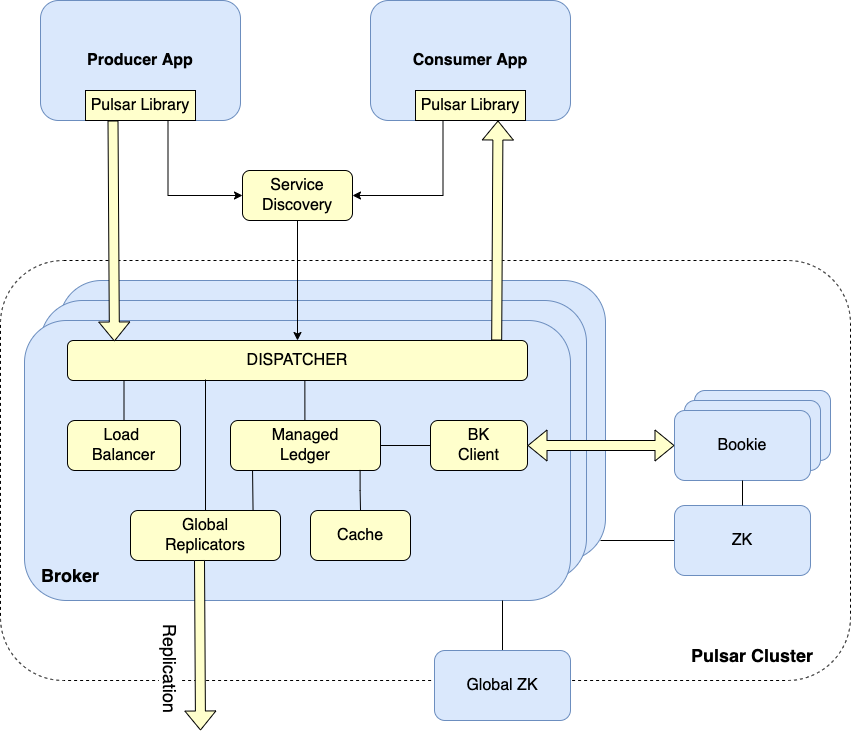

# Description

[Apache Pulsar](https://pulsar.apache.org) is a distributed, open source pub-sub messaging and streaming platform for real-time workloads, managing hundreds of billions of events per day.

Apache Pulsar offers many features, most notable being:

- Native support for multiple clusters in a Pulsar instance, with seamless [geo-replication](https://pulsar.apache.org/docs/next/administration-geo) of messages across clusters.
- Very low publish and end-to-end latency.
- Seamless scalability to over a million topics.
- A simple [client API](https://pulsar.apache.org/docs/next/concepts-clients) with bindings for [Java](https://pulsar.apache.org/docs/next/client-libraries-java), [Go](https://pulsar.apache.org/docs/next/client-libraries-go), [Python](https://pulsar.apache.org/docs/next/client-libraries-python) and [C++](https://pulsar.apache.org/docs/next/client-libraries-cpp).
- Multiple [subscription types](https://pulsar.apache.org/docs/next/concepts-messaging#subscription-types) (exclusive, shared, and failover) for topics.
- Guaranteed message delivery with [persistent message storage](https://pulsar.apache.org/docs/next/concepts-architecture-overview#persistent-storage) provided by [Apache BookKeeper](http://bookkeeper.apache.org).
- A serverless light-weight computing framework [Pulsar Functions](https://pulsar.apache.org/docs/next/functions-overview) offers the capability for stream-native data processing.
- A serverless connector framework [Pulsar IO](https://pulsar.apache.org/docs/next/io-overview), which is built on Pulsar Functions, makes it easier to move data in and out of Apache Pulsar.
- [Tiered Storage](https://pulsar.apache.org/docs/next/concepts-tiered-storage) offloads data from hot/warm storage to cold/longterm storage (such as S3 and GCS) when the data is aging out.

On top of that, Apache Pulsar offers [Prometheus Monitoring](https://pulsar.apache.org/docs/deploy-monitoring) support for metrics related to the usage of topics, and the overall health of the individual components of the cluster.

## Apache Pulsar Architecture Overview

At the highest level, a Pulsar instance is composed of one or more Pulsar clusters. Clusters within an instance can [replicate](https://pulsar.apache.org/docs/next/concepts-replication) data amongst themselves.

Each Pulsar cluster is composed of:

1. One or more brokers used to route messages between producers and consumers. Message brokers are also [load balanced](https://pulsar.apache.org/docs/next/administration-load-balance#load-balance-across-pulsar-brokers).
2. A BookKeeper instance (called a Bookie) to handle [messages persistence](https://pulsar.apache.org/docs/next/concepts-architecture-overview#persistent-storage).
3. A Zookeeper instance to handle coordination tasks between clusters.

Please visit the official [documentation page](https://pulsar.apache.org/docs/next/concepts-architecture-overview) for more information about Apache Pulsar clusters architecture and all involved components.

Below diagram illustrates the basic architecture of each Apache Pulsar cluster:



**Notes:**

- This stack requires a minimum configuration of 2 Nodes at the $20/month plan (4GB memory / 2 vCPU).
- A total of 70Gi block storage (split across 7 PVs) is required for topics persistence and Pulsar cluster metadata.
- This stack also includes a $10/month DigitalOcean Load Balancer to ensure that traffic is distributed across all proxy instances of your Pulsar clusters.
- DigitalOcean uses Helm v3 to deploy Apache Pulsar to your DOKS cluster.

## Software Included

| Package | Apache Pulsar Version | Helm Chart Version | License |
|---------|-----------------------| ------------------ |-------- |
| Apache Pulsar | [2.9.2](https://github.com/apache/pulsar/releases/tag/v2.9.2) | [2.9.3](https://github.com/apache/pulsar-helm-chart/releases/tag/pulsar-2.9.3) |[Apache 2.0](https://github.com/apache/pulsar/blob/master/LICENSE) |

## Getting Started

### How to Connect to Your Cluster

Follow these [instructions](https://www.digitalocean.com/docs/kubernetes/how-to/connect-to-cluster/) to connect to your cluster with `kubectl` and `doctl`.

### Confirming that Apache Pulsar is Running

First, check if the Helm installation was successful by running the command below:

```console
helm ls -n pulsar
```

The output looks similar to the following:

```text
NAME            NAMESPACE       REVISION        UPDATED                                 STATUS          CHART           APP VERSION
apache-pulsar   pulsar          1               2022-06-15 07:03:30.307164 +0300 EEST   deployed        pulsar-2.9.3    2.9.2
```

The `STATUS` column value should be `deployed`.

Next, verify if Apache Pulsar pods are up and running:

```console
kubectl get pods -n pulsar
```

The output looks similar to the following:

```text
NAME                                            READY   STATUS      RESTARTS        AGE
apache-pulsar-bookie-0                          1/1     Running     0               8m31s
apache-pulsar-bookie-1                          1/1     Running     0               8m31s
apache-pulsar-bookie-init--1-v2plh              0/1     Completed   0               8m31s
apache-pulsar-broker-0                          1/1     Running     1 (4m42s ago)   8m32s
apache-pulsar-broker-1                          1/1     Running     0               8m32s
apache-pulsar-proxy-0                           1/1     Running     0               8m32s
apache-pulsar-proxy-1                           1/1     Running     0               8m31s
apache-pulsar-pulsar-manager-5dcf97f85f-tbvbf   1/1     Running     0               8m31s
apache-pulsar-pulsar-init--1-8zn69              0/1     Completed   0               8m31s
apache-pulsar-recovery-0                        1/1     Running     0               8m32s
apache-pulsar-toolset-0                         1/1     Running     0               8m32s
apache-pulsar-zookeeper-0                       1/1     Running     0               8m31s
apache-pulsar-zookeeper-1                       1/1     Running     0               8m31s
apache-pulsar-zookeeper-2                       1/1     Running     0               8m31s
```

All important pods such as `Bookies`, `Brokers`, `Proxies` and `Zookeeper` should be in a `READY` state with a `STATUS` of `Running`.

### Tweaking Helm Chart Values

The Apache Pulsar stack provides some custom values to start with. See the [values](./values.yml) file from the main GitHub repository for more information.

You can inspect all the available options, as well as the default values for the Apache Pulsar Helm chart by running the following command:

```console
helm show values apache/pulsar --version 2.9.3
```

After customizing the Helm values file (`values.yml`), you can apply the changes via the `helm upgrade` command, as shown below:

```console
helm upgrade apache-pulsar apache/pulsar --version 2.9.3 \
  --namespace pulsar \
  --values values.yml
```

### Verifying the Apache Pulsar Setup

The Helm chart provided by the Apache Pulsar 1-click app deploys a `toolset` pod containing various utilities (e.g. `pulsar-admin`, `pulsar-client`). You can use the pulsar CLI tools to administer various resources such as tenants, namespaces and topics. Also, you can create consumers and producers to test pub/sub functionality.

For demonstration purposes you will learn how to create a tenant (called `apache`). Then, you will create the associated resources such as a dedicated namespace named `pulsar`, and a partitioned pub/sub topic named `test-topic`.

First, you will use the `pulsar-admin` CLI from the `toolset` container to create the `apache` tenant:

```console
kubectl exec -it -n pulsar apache-pulsar-toolset-0 -- bin/pulsar-admin tenants create apache
```

Then, list all tenants to see if it was created successfully:

```console
 kubectl exec -it -n pulsar apache-pulsar-toolset-0 -- bin/pulsar-admin tenants list
```

The output looks similar to:

```text
"apache"
"public"
"pulsar"
```

The `apache` tenant should be present in the listing.

Next, you will create a dedicated namespace name `pulsar` in the `apache` tenant to hold resources (such as pub/sub topics):

```console
kubectl exec -it -n pulsar apache-pulsar-toolset-0 -- bin/pulsar-admin namespaces create apache/pulsar
```

Now, check if the `pulsar` namespace was created in the tenant `apache`:

```console
kubectl exec -it -n pulsar apache-pulsar-toolset-0 -- bin/pulsar-admin namespaces list apache
```

The output looks similar to:

```text
"apache/pulsar"
```

The `apache/pulsar` value should be present in the output listing.

Now, you will learn how to create a partitioned pub/sub topic to send and read messages from. By default, Pulsar topics are served by a single broker. [Partitioned topics](https://pulsar.apache.org/docs/2.9.2/concepts-messaging/#partitioned-topics) are a special type of topic that can be handled by multiple brokers leading to much higher throughput.

You can use the `pulsar-admin` CLI tool, and create a 2 partition (`-p 2`) topic named `test-topic` in the `apache/pulsar` namespace:

```console
kubectl exec -it -n pulsar apache-pulsar-toolset-0 -- bin/pulsar-admin topics create-partitioned-topic apache/pulsar/test-topic -p 2
```

Next, list the available topics from the `apache/pulsar` namespace:

```console
kubectl exec -it -n pulsar apache-pulsar-toolset-0 -- bin/pulsar-admin topics list-partitioned-topics apache/pulsar
```

The output looks similar to:

```text
"persistent://apache/pulsar/test-topic"
```

The `test-topic` should be present in the output listing. You can also notice that the `test-topic` data is persisted (denoted by the `persistent` prefix).

Finally, you can test the setup by setting a producer on one side, and a consumer on the other end. The `toolset` Pod provided by Pulsar contains a small utility to help you achieve this task called `pulsar-client`.

First, open a new terminal and set the consumer for the `apache/pulsar/test-topic` topic on one end:

```console
kubectl exec -it -n pulsar apache-pulsar-toolset-0 -- bin/pulsar-client consume -s sub apache/pulsar/test-topic -n 0
```

You will notice some debugging information dumped in the terminal before the client (or the consumer) is set up. The output looks similar to:

```text
...
2022-06-15T08:35:52,936+0000 [pulsar-client-io-1-1] INFO  org.apache.pulsar.client.impl.MultiTopicsConsumerImpl - [apache/pulsar/test-topic] [sub] Success subscribe new topic persistent://apache/pulsar/test-topic in topics consumer, partitions: 2, allTopicPartitionsNumber: 2
```

Looking at the last line from the output, you can notice that the client successfully subscribed to the `persistent://apache/pulsar/test-topic` topic.

As a final step, open another terminal and create a producer to publish the `hello apache pulsar` message 10 times (`-n 10` flag), using the `apache/pulsar/test-topic` topic:

```console
kubectl exec -it -n pulsar apache-pulsar-toolset-0 -- bin/pulsar-client produce apache/pulsar/test-topic  -m "---------hello apache pulsar-------" -n 10
```

Check the consumer terminal - you should see the `hello apache pulsar` message published exactly `10 times`:

```text
----- got message -----
key:[null], properties:[], content:---------hello apache pulsar-------
----- got message -----
key:[null], properties:[], content:---------hello apache pulsar-------
----- got message -----
key:[null], properties:[], content:---------hello apache pulsar-------
----- got message -----
key:[null], properties:[], content:---------hello apache pulsar-------
----- got message -----
key:[null], properties:[], content:---------hello apache pulsar-------
----- got message -----
key:[null], properties:[], content:---------hello apache pulsar-------
----- got message -----
key:[null], properties:[], content:---------hello apache pulsar-------
----- got message -----
key:[null], properties:[], content:---------hello apache pulsar-------
----- got message -----
key:[null], properties:[], content:---------hello apache pulsar-------
----- got message -----
key:[null], properties:[], content:---------hello apache pulsar-------
```

If the output looks similar to above, then you configured Apache Pulsar correctly.

You can also configure external consumers or producers to use your Apache Pulsar cluster by pointing to the `apache-pulsar-proxy` service endpoint. Below command will print information about the `apache-pulsar-proxy` endpoint:

```console
kubectl get svc/apache-pulsar-proxy -n pulsar
```

The output looks similar to:

```text
NAME                  TYPE           CLUSTER-IP       EXTERNAL-IP      PORT(S)                       AGE
apache-pulsar-proxy   LoadBalancer   10.245.234.115   138.197.229.41   80:30742/TCP,6650:30318/TCP   4h49m
```

In the above output the Apache Pulsar proxy endpoint listens on port `6650`, and uses the `138.197.229.41` public IP.

For securing Apache Pulsar public facing components (e.g. proxies), such as setting up TLS certificates and authorization, please visit the [TLS setup](https://pulsar.apache.org/docs/2.9.2/helm-deploy/#tls), [Authentication](https://pulsar.apache.org/docs/2.9.2/helm-deploy/#authentication), and [Authorization](https://pulsar.apache.org/docs/2.9.2/helm-deploy/#authorization) sections from the Apache Pulsar Helm installation documentation page.

## Upgrading Apache Pulsar Stack

You can check what versions are available to upgrade, by navigating to the [pulsar-helm-chart](https://github.com/apache/pulsar-helm-chart/releases) releases page on GitHub.

Then, to upgrade the Apache Pulsar stack to a newer version, please run the following command, replacing the `<>` placeholders:

```console
helm upgrade apache-pulsar apache/pulsar \
  --version <APACHE_PULSAR_NEW_VERSION> \
  --namespace pulsar \
  --values <YOUR_APACHE_PULSAR_HELM_VALUES_FILE>
```

See [helm upgrade](https://helm.sh/docs/helm/helm_upgrade/) for more information about the command. Also, please make sure the read the [Upgrade guidelines](https://pulsar.apache.org/docs/2.9.2/administration-upgrade) from the Apache Pulsar official documentation page.

## Uninstalling Apache Pulsar Stack

To delete your installation of `apache-pulsar`, run the following command:

```console
helm uninstall apache-pulsar -n pulsar
```

**Note:**

The command will delete all the associated Kubernetes resources installed by the `apache-pulsar` Helm chart, except the namespace itself. To delete the `pulsar namespace` as well, run the following command:

```console
kubectl delete ns pulsar
```

**ATTENTION: Deleting the `pulsar` namespace, will also remove all volumes created by the setup. It means, Bookkeeper and Zookeeper data will be gone. So, make sure to backup your data first !!!**

### Additional Resources

To study more about Apache Pulsar, you can visit the following topics:

- [Apache Pulsar Concepts and Architecture](https://pulsar.apache.org/docs/2.9.2/concepts-overview)
- [APache Pulsar Functions](https://pulsar.apache.org/docs/2.9.2/functions-overview)
- [APache Pulsar Helm Install and Options](https://pulsar.apache.org/docs/2.9.2/helm-overview)
- [Apache Pulsar Administration Topics](https://pulsar.apache.org/docs/2.9.2/administration-zk-bk)
- [Apache Pulsar Security Topics](https://pulsar.apache.org/docs/2.9.2/security-overview)
- [Apache Pulsar Performance](https://pulsar.apache.org/docs/2.9.2/performance-pulsar-perf)
- [Apache Pulsar Development Tools](https://pulsar.apache.org/docs/2.9.2/develop-tools)
- [Apache Pulsar Monitoring using Prometheus](https://pulsar.apache.org/docs/2.9.2/deploy-monitoring)
