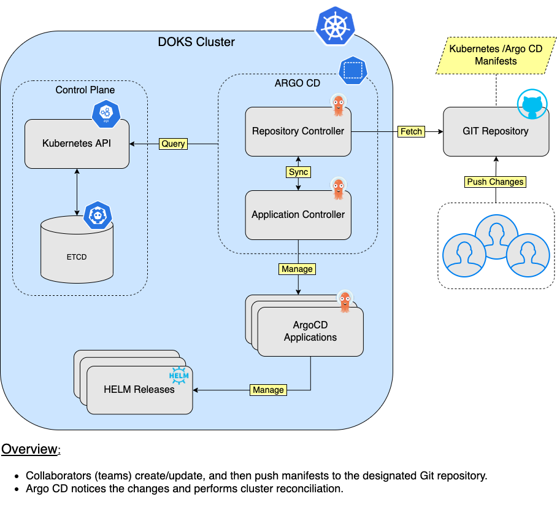
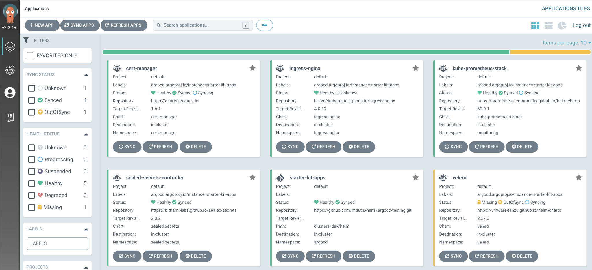
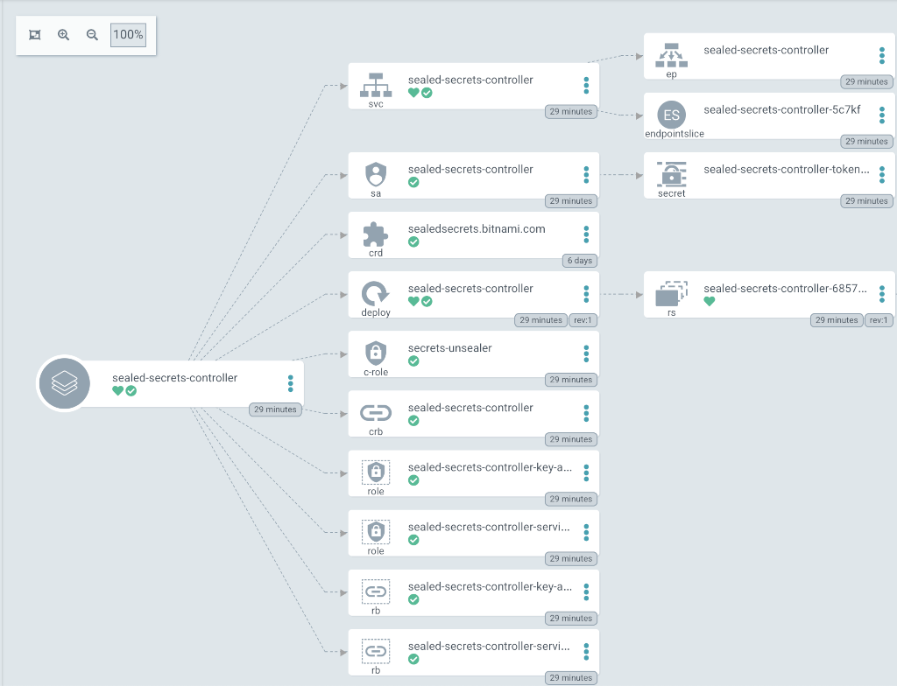
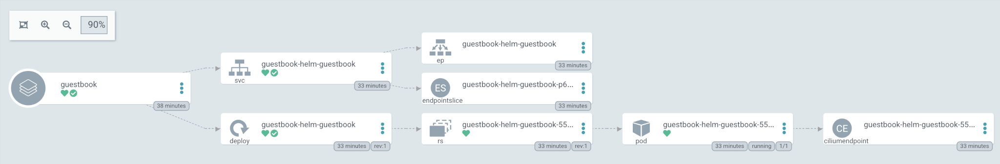
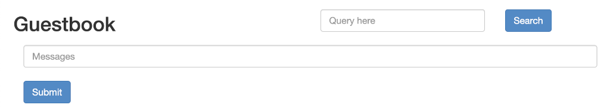

# Description

[Argo CD](https://argoproj.github.io/cd) is a popular open source implementation for doing GitOps continuous delivery on top of Kubernetes. Your applications, definitions, configurations, and environments should be declarative and version controlled. Also application deployment and lifecycle management should be automated, auditable, and easy to understand. All this can be done using Argo.

Argo CD adheres to the same GitOps patterns and principles, thus maintaining your cluster state using a declarative approach. Synchronization happens via a Git repository, where your Kubernetes manifests are being stored. Kubernetes manifests can be specified in several ways:

- [Kustomize](https://kustomize.io) applications.
- [Helm](https://helm.sh) charts.
- [Ksonnet](https://ksonnet.io) applications.
- [Jsonnet](https://jsonnet.org) files.
- Plain directory of YAML/json manifests.
- Any custom config management tool configured as a config management plugin.

As with every application that runs in a Kubernetes cluster, Argo CD is configured via custom resource definitions (CRDs) stored inside YAML manifests. The most important one is the [Application](https://argo-cd.readthedocs.io/en/stable/operator-manual/declarative-setup/#applications) CRD. In an Argo CD application, you define which Git repository should be used to synchronize which Kubernetes cluster. It can be the same Kubernetes cluster where Argo CD is deployed, or an external one.

Argo CD is implemented as a Kubernetes Controller which continuously monitors running applications and compares the current (or live) state against the desired target state (as specified in the Git repo). A deployed application whose live state deviates from the target state is considered `OutOfSync`. Argo CD reports and visualizes the differences, while providing facilities to automatically or manually sync the live state back to the desired target state.

Argo CD offers many features, most notable being:

- Support for multiple config management/templating tools, such as: `Kustomize`, `Helm`, `Ksonnet`, `Jsonnet`, `plain-YAML`.
- Ability to manage and deploy to multiple clusters.
- SSO Integration (`OIDC`, `OAuth2`, `LDAP`, `SAML 2.0`, `GitHub`, `GitLab`, `Microsoft`, `LinkedIn`).
- Multi-tenancy and RBAC policies for authorization.
- Health status analysis of application resources.
- Rollback/Roll-anywhere to any application configuration committed in Git repository.
- Automated configuration drift detection and visualization.
- Web UI which provides real-time view of application activity.
- CLI for automation and CI integration.
- Webhook integration (GitHub, BitBucket, GitLab).
- PreSync, Sync, PostSync hooks to support complex application rollouts (e.g. blue/green and canary upgrades).
- Prometheus metrics.

## DOKS and Argo CD for Helm Releases Overview

Below diagram shows how Argo CD manages Helm applications hosted using a Git repository:



**Notes:**

- DigitalOcean uses Helm v3 to deploy Argo CD to your DOKS cluster.

## Software Included

| Package | Argo CD Version | Helm Chart Version | License |
|---------|-----------------| ------------------ |-------- |
| Argo CD | [2.4.0](https://github.com/argoproj/argo-cd/releases/tag/v2.4.0) | [4.9.4](https://github.com/argoproj/argo-helm/releases/tag/argo-cd-4.9.4) |[Apache 2.0](https://github.com/argoproj/argo-cd/blob/master/LICENSE) |

## Getting Started

### How to Connect to Your Cluster

Follow these [instructions](https://www.digitalocean.com/docs/kubernetes/how-to/connect-to-cluster/) to connect to your cluster with `kubectl` and `doctl`.

### Confirming that Argo CD is Running

First, check if the Helm installation was successful by running the command below:

```console
helm ls -n argocd
```

The output looks similar to the following:

```text
NAME    NAMESPACE       REVISION        UPDATED                                 STATUS          CHART           APP VERSION
argocd  argocd          1               2022-04-04 17:45:41.52626 +0300 EEST    deployed        argo-cd-4.9.4   v2.4.0 
```

The `STATUS` column value should be `deployed`.

Next, verify if Argo CD pods are up and running:

```console
kubectl get pods -n argocd
```

The output looks similar to the following:

```text
NAME                                                READY   STATUS    RESTARTS   AGE
argocd-application-controller-0                     1/1     Running   0          3m
argocd-applicationset-controller-59496dddbf-6zts8   1/1     Running   0          6m4s
argocd-dex-server-bc7645bb4-x4w5k                   1/1     Running   0          6m2s
argocd-notifications-controller-756bc985-bgs2p      1/1     Running   0          6m3s
argocd-redis-548fbb679d-chgk7                       1/1     Running   0          3m2s
argocd-repo-server-7b455bd4bb-sjc84                 1/1     Running   0          2m43s
argocd-repo-server-7b455bd4bb-wgvvj                 1/1     Running   0          3m3s
argocd-server-7ff47f4c78-hbbcm                      1/1     Running   0          2m42s
argocd-server-7ff47f4c78-jsdcx                      1/1     Running   0          3m2s
```

All pods should be in a `READY` state with a `STATUS` of `Running`.

### Tweaking Helm Chart Values

The argocd stack provides some custom values to start with. See the [values](./values.yml) file from the main GitHub repository for more information.

You can inspect all the available options, as well as the default values for the argo-cd Helm chart by running the following command:

```console
helm show values argo/argo-cd --version 4.9.4
```

After customizing the Helm values file (`values.yml`), you can apply the changes via the `helm upgrade` command, as shown below:

```console
helm upgrade argocd argo/argo-cd --version 4.9.4 \
  --namespace argocd \
  --values values.yml
```

### Exploring the Argo CD Web Interface

One of the neat features that Argo CD has to offer is the web interface, used to perform various administrative tasks and view application deployments status. You can create applications using the graphical user interface, and interact with Argo CD in various ways. Another important feature, is the ability to inspect each application state and access Kubernetes events, as well as your application logs. On top of that, Argo CD provides a visual representation of all Kubernetes objects (replicasets, pods, etc) each application deployment is using.

The web interface can be accessed by port-forwarding the `argocd-server` Kubernetes service. Please run below command in a shell terminal:

```shell
kubectl port-forward svc/argocd-server -n argocd 8080:443
```

Now, open a web browser and navigate to [localhost:8080](http://localhost:8080) (please ignore the invalid TLS certificates for now). You will be greeted with the Argo CD log in page. The default administrator username is `admin`, and the password is generated randomly at installation time. You can fetch it by running below command:

```shell
kubectl -n argocd get secret argocd-initial-admin-secret -o jsonpath="{.data.password}" | base64 -d; echo
```

Next, you will be redirected to the applications dashboard page. From here you can view, create or manage applications via the UI (an YAML editor is also available), as well as perform sync or refresh operations:



If you click on any application tile, a visual representation of all involved objects is also shown:



You can also manage your application projects, repositories and clusters. Please go ahead and explore each section and sub-section in detail to see all the available features.

### Getting to Know the Argo CD CLI

Argo CD allows same set of features to be used either via the web interface, or via the CLI. To use the `argocd` CLI, you need to open a separate shell window and just type `argocd` without any arguments. By default, it will display the available commands and options:

```text
argocd controls a Argo CD server

Usage:
  argocd [flags]
  argocd [command]

Available Commands:
  account     Manage account settings
  admin       Contains a set of commands useful for Argo CD administrators and requires direct Kubernetes access
  app         Manage applications
  cert        Manage repository certificates and SSH known hosts entries
  cluster     Manage cluster credentials
  completion  output shell completion code for the specified shell (bash or zsh)
  context     Switch between contexts
  gpg         Manage GPG keys used for signature verification
  help        Help about any command
...
```

For any command or sub-command, you can invoke the corresponding help page using the following pattern: `argocd <command/subcommand> --help`. For example, if you want to check what options are available for the `app` command:

```shell
argocd app --help
```

The output looks similar to:

```text
Manage applications

Usage:
  argocd app [flags]
  argocd app [command]

Examples:
  # List all the applications.
  argocd app list
  
  # Get the details of a application
  argocd app get my-app
...
```

Please go ahead and explore other commands/subcommands as well to see all the available options.

### Creating Your First Argo CD Application

Argo CD is using the [Application](https://argo-cd.readthedocs.io/en/stable/operator-manual/declarative-setup/#applications) core concept to manage applications deployment and lifecycle. Inside an Argo CD application manifest you define the Git repository hosting your application definitions, as well as the corresponding Kubernetes cluster to deploy applications. In other words, an Argo CD application defines the relationship between a source repository and a Kubernetes cluster. It's a very concise and scalable design, where you can associate multiple sources (Git repositories) and corresponding Kubernetes clusters.

It's not mandatory to use a Git repository as a source, you can also use Helm repositories. Following steps will show you how to deploy a Helm packaged application using Argo CD.

First, you need to port-forward the Argo CD main server on your local machine in a separate terminal window:

```shell
kubectl port-forward svc/argocd-server -n argocd 8080:443
```

Next, Argo CD API server access is required for argocd CLI to work. Using another terminal window, you need to authenticate argocd CLI with your Argo CD server instance:

```shell
ADMIN_USER="admin"
ADMIN_PASSWD="$(kubectl -n argocd get secret argocd-initial-admin-secret -o jsonpath="{.data.password}" | base64 -d)"

argocd login localhost:8080 --username $ADMIN_USER --password $ADMIN_PASSWD --insecure
```

The output looks similar to:

```text
'admin:login' logged in successfully
Context 'localhost:8080' updated
```

Now, create the sample guestbook application:

```console
argocd app create guestbook --repo https://github.com/argoproj/argocd-example-apps.git --path helm-guestbook --dest-server https://kubernetes.default.svc --dest-namespace default
```

Next, check application state:

```console
argocd app list
```

The output looks similar to:

```text
NAME       CLUSTER                         NAMESPACE  PROJECT  STATUS     HEALTH   SYNCPOLICY  CONDITIONS ...
guestbook  https://kubernetes.default.svc  default    default  OutOfSync  Missing  <none>      <none>     ...
```

**Important note:**

By default, Argo CD doesn't sync (deploy) your applications unless told to (or if a automatic syncing policy is set). You can read more about [auto sync policies](https://argo-cd.readthedocs.io/en/stable/user-guide/auto_sync) on the official documentation website.

Now, you can trigger a sync for the guestbook application:

```console
argocd app sync guestbook
```

The output looks similar to:

```text
Name:               guestbook
Project:            default
...
Message:            successfully synced (all tasks run)

GROUP  KIND        NAMESPACE  NAME                      STATUS  HEALTH       HOOK  MESSAGE
       Service     default    guestbook-helm-guestbook  Synced  Healthy            service/guestbook-helm-guestbook created
apps   Deployment  default    guestbook-helm-guestbook  Synced  Progressing        deployment.apps/guestbook-helm-guestbook created
```

Inspect again the guestbook app state:

```console
argocd app list
```

The output looks similar to (`STATUS` column should display `Synced`, and `HEALTH` column should display `Healthy`):

```text
NAME       CLUSTER                         NAMESPACE  PROJECT  STATUS  HEALTH  SYNCPOLICY  CONDITIONS  ...
guestbook  https://kubernetes.default.svc  default    default  Synced  Healthy  <none>      <none>     ...
```

You can also open a web browser and navigate to [localhost:8080](http://localhost:8080) to inspect the guestbook application state. When asked for credentials, type `admin` for the username, and password can be fetched via:

```console
kubectl -n argocd get secret argocd-initial-admin-secret -o jsonpath="{.data.password}" | base64 -d
```

You should see the guestbook application tile:


Click on the guestbook tile to check guestbook application composition (you can further click on each corresponding tile to find more information about each component, like deployments, services, pods and application logs, etc):



Finally, check if the guestbook application is running:

```console
kubectl port-forward svc/guestbook-helm-guestbook 8088:80
```

Open a web browser and navigate to [localhost:8088](http://localhost:8088):



If the output looks like above, then you created your first Argo CD application successfully. Next, please go ahead and read more about Argo CD [core concepts](https://argo-cd.readthedocs.io/en/stable/core_concepts) on the official documentation website.

## Upgrading Argo CD Stack

You can check what versions are available to upgrade, by navigating to the [argo-helm](https://github.com/argoproj/argo-helm/releases) releases page on GitHub.

Then, to upgrade the stack to a newer version, please run the following command, replacing the `<>` placeholders:

```console
helm upgrade argocd argo/argo-cd \
  --version <ARGO_CD_NEW_VERSION> \
  --namespace argocd \
  --values <YOUR_ARGO_CD_HELM_VALUES_FILE>
```

See [helm upgrade](https://helm.sh/docs/helm/helm_upgrade/) for more information about the command.

## Uninstalling Argo CD Stack

To delete your installation of `argo-cd`, run the following command:

```console
helm uninstall argocd -n argocd
```

**Note:**

The command will delete all the associated Kubernetes resources installed by the `argo-cd` Helm chart, except the namespace itself. To delete the `argocd namespace` as well, run the following command:

```console
kubectl delete ns argocd
```

### Additional Resources

To study more about Argo CD, you can visit the following topics:

- [Application Projects](https://argo-cd.readthedocs.io/en/stable/user-guide/projects)
- [Overriding Application Parameters](https://argo-cd.readthedocs.io/en/stable/user-guide/parameters)
- [Working with Private Git Repositories](https://argo-cd.readthedocs.io/en/stable/user-guide/private-repositories)
- [Orphaned Resources Monitoring](https://argo-cd.readthedocs.io/en/stable/user-guide/orphaned-resources)
- [Tracking and Deployment Strategies](https://argo-cd.readthedocs.io/en/stable/user-guide/tracking_strategies)
- [Resource Tracking](https://argo-cd.readthedocs.io/en/stable/user-guide/resource_tracking)
- [Sync Phases and Waves](https://argo-cd.readthedocs.io/en/stable/user-guide/sync-waves)
- [Notifications](https://argo-cd.readthedocs.io/en/stable/user-guide/subscriptions)
- [Best Practices Guide](https://argo-cd.readthedocs.io/en/stable/user-guide/best_practices)
- [Security Considerations](https://argo-cd.readthedocs.io/en/stable/security_considerations)
- [Progressive Delivery using Argo Rollouts](https://argoproj.github.io/argo-rollouts)
