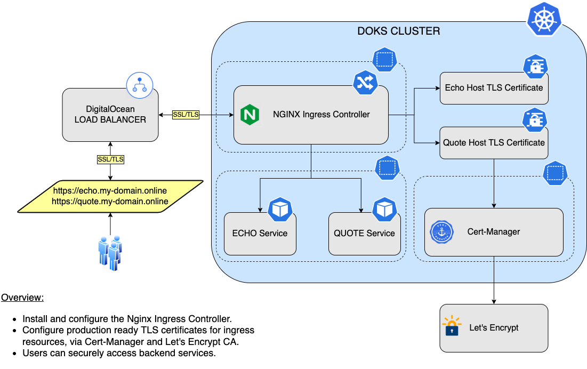

# Description

[Cert-Manager](https://cert-manager.io/) is an open-source certificate management tool designed to work with Kubernetes. It supports all the required operations for obtaining, renewing, and using SSL/TLS certificates. Cert-Manager can talk with various certificate authorities (CAs), like [Let's Encrypt](https://letsencrypt.org/), [HashiCorp Vault](https://www.vaultproject.io/), and [Venafi](https://www.venafi.com/). It can also automatically issue valid certificates for you and renew them before they expire.

SSL/TLS certificates secure your connections and data by verifying the identity of hosts/sites and encrypting your data. Cert-Manager manages them by integrating with your Kubernetes cluster's Ingress Controller, which is your cluster's main entry point and sits in front of its backend services. Then, you can provide identity information to users by presenting them a valid SSL/TLS certificate whenever they visit your website(s).

See Cert-Manager's [official documentation](https://cert-manager.io/docs/).

**Note:**

DigitalOcean is using Helm v3 to deploy Cert-Manager to your DOKS cluster.

## Cert-Manager Overview Diagram

The following diagram shows how Cert-Manager works in conjunction with the Nginx Ingress Controller:



## Software Included

| Package | Cert-Manager Version                                                        | Helm Chart Version                                                              | License |
|---------|-----------------------------------------------------------------------------|---------------------------------------------------------------------------------|---------|
| Cert-Manager | [1.11.0](https://github.com/cert-manager/cert-manager/releases/tag/v1.11.0) | [1.11.0](https://artifacthub.io/packages/helm/cert-manager/cert-manager/1.11.0) | [Apache 2.0](https://github.com/cert-manager/cert-manager/blob/master/LICENSE) |

## Getting Started

### Connecting to Your Cluster

You can connect to your DigitalOcean Kubernetes cluster by following our [how-to guide](https://www.digitalocean.com/docs/kubernetes/how-to/connect-to-cluster/).

For additional instructions on configuring a [DigitalOcean Kubernetes](https://cloud.digitalocean.com/kubernetes/clusters/) cluster, see the following guides:

- [How to Set Up a DigitalOcean Managed Kubernetes Cluster (DOKS)](https://github.com/digitalocean/Kubernetes-Starter-Kit-Developers/tree/main/01-setup-DOKS#how-to-set-up-a-digitalocean-managed-kubernetes-cluster-doks)
- [How to Set up DigitalOcean Container Registry](https://github.com/digitalocean/Kubernetes-Starter-Kit-Developers/tree/main/02-setup-DOCR#how-to-set-up-digitalocean-container-registry)

### Verifying that Cert-Manager is Running

First, verify that the Helm installation was successful by running following command:

```console
helm ls -n cert-manager
```

If the installation was successful, the `STATUS` column value in the output reads `deployed`:

```text
NAME            NAMESPACE       REVISION        UPDATED                                 STATUS          CHART                   APP VERSION
cert-manager    cert-manager    1               2023-04-20 07:51:00.307798 +0200 EET    deployed        cert-manager-v1.11.0     v1.11.0
```

Next, verify that the Cert-Manager pods are up and running with the following command:

```console
kubectl get pods -n cert-manager
```

If they're running, all pods listed in the output are in a `READY` state and the `STATUS` for each reads `Running`:

```text
NAME                                       READY   STATUS    RESTARTS   AGE
cert-manager-57d89b9548-94r5z              1/1     Running   0          3m24s
cert-manager-cainjector-5bcf77b697-hkv2k   1/1     Running   0          3m24s
cert-manager-webhook-9cb88bd6d-mxhgh       1/1     Running   0          3m24s
```

### Tweaking Helm Chart Values

The `cert-manager` has custom default Helm values. See the [values](./values.yml) file from the main GitHub repository (explanations are provided inside, where necessary).

To inspect its current values, run the following command:

```console
helm show values jetstack/cert-manager --version 1.11.0
```

To change these values, open the Helm values file `values.yml`, change whatever values you want, save and exit the file, and apply the changes by running `helm upgrade` command:

```console
helm upgrade cert-manager jetstack/cert-manager --version 1.11.0 \
  --namespace cert-manager \
  --values values.yml
```

### Configuring TLS Certificates via Cert-Manager

Cert-Manager expects you to create some typical CRDs to operate. First, create a certificate [Issuer](https://cert-manager.io/docs/concepts/issuer/) CRD. Next, the `Issuer` CRD tries to fetch a valid TLS certificate for your Ingress Controller, such as Nginx, from a known authority, such as [Let's Encrypt](https://letsencrypt.org/). To accomplish this, the `Issuer` uses the `HTTP-01` challenge. It also knows how to perform `DNS-01` challenges as well, for wildcard certificates.

Then, Cert-Manager needs a [Certificate](https://cert-manager.io/docs/concepts/certificate/) CRD to store the actual certificate. The `Certificate` CRD doesn't work alone, and needs a reference to an `Issuer` CRD to be able to fetch the real certificate from the `CA` (Certificate Authority).

A typical `Issuer` manifest looks like the following example:

```yaml
apiVersion: cert-manager.io/v1
kind: Issuer
metadata:
  name: letsencrypt-nginx
  namespace: backend
spec:
  # ACME issuer configuration
  # `email` - the email address to be associated with the ACME account (make sure it's a valid one)
  # `server` - the URL used to access the ACME server’s directory endpoint
  # `privateKeySecretRef` - Kubernetes Secret to store the automatically generated ACME account private key
  acme:
    email: <YOUR_VALID_EMAIL_ADDRESS_HERE>
    server: https://acme-v02.api.letsencrypt.org/directory
    privateKeySecretRef:
      name: letsencrypt-nginx-private-key
    solvers:
      # Use the HTTP-01 challenge provider
      - http01:
          ingress:
            class: nginx
```

Next, configure each Nginx ingress resource to use TLS termination. A typical manifest looks like the following example:

```yaml
apiVersion: networking.k8s.io/v1
kind: Ingress
metadata:
  name: ingress-echo
  namespace: backend
  annotations:
    cert-manager.io/issuer: letsencrypt-nginx
spec:
  tls:
  - hosts:
    - echo.my-domain.org
    secretName: letsencrypt-nginx
  rules:
    - host: echo.my-domain.org
...
```

For more information on the above configuration:

- `cert-manager.io/issuer`: Annotation that takes advantage of cert-manager ingress-shim to create the certificate resource on your behalf.
- `spec.tls.hosts`: List of hosts included in the TLS certificate.
- `spec.tls.secretName`: Name of the secret used to terminate TLS traffic on port 443.

Notice that the `Nginx Ingress Controller` is able to generate the `Certificate` CRD automatically via a special annotation: `cert-manager.io/issuer`. This saves work and time, because then you don't have to create and maintain a separate manifest for certificates as well, since only the `Issuer` manifest is a requirement. For other ingresses, you may need to provide the `Certificate` CRD as well.

### Upgrading Cert-Manager Stack

You can check what versions are available to upgrade by navigating to the [cert-manager](https://github.com/cert-manager/cert-manager/releases) official releases page from GitHub. Alternatively, you can use [ArtifactHUB](https://artifacthub.io/packages/helm/cert-manager/cert-manager).

To upgrade the stack to a newer version, run the following command, replacing the `< >` placeholders with their corresponding information:

```console
helm upgrade cert-manager jetstack/cert-manager \
  --version <CERT_MANAGER_NEW_VERSION> \
  --namespace cert-manager \
  --values <YOUR_HELM_VALUES_FILE>
```

See [helm upgrade](https://helm.sh/docs/helm/helm_upgrade/) for command documentation.

Also, see the official recommendations for various [upgrade paths](https://cert-manager.io/docs/installation/upgrading/), from an existing release to a new major version of Cert-Manager.

### Uninstalling Cert-Manager Stack

To delete your installation of `cert-manager`, run the following `Helm` command:

```console
helm uninstall cert-manager -n cert-manager
```

**Note:**

The above command will delete all the associated `Kubernetes` resources installed by the `cert-manager` Helm chart, except the namespace itself. To delete the `cert-manager namespace` as well, run following command:

```console
kubectl delete ns cert-manager
```

### Additional Resources

- [Kubernetes Starter Kit](https://github.com/digitalocean/Kubernetes-Starter-Kit-Developers/)
- [Configuring Production Ready TLS Certificates for Nginx](https://github.com/digitalocean/Kubernetes-Starter-Kit-Developers/blob/main/03-setup-ingress-controller/nginx.md#step-5---configuring-production-ready-tls-certificates-for-nginx)
- [Configuring Wildcard Certificates via Cert-Manager](https://github.com/digitalocean/Kubernetes-Starter-Kit-Developers/blob/main/03-setup-ingress-controller/guides/wildcard_certificates.md)
- [Official Cert-Manager Tutorials](https://cert-manager.io/next-docs/tutorials/)
