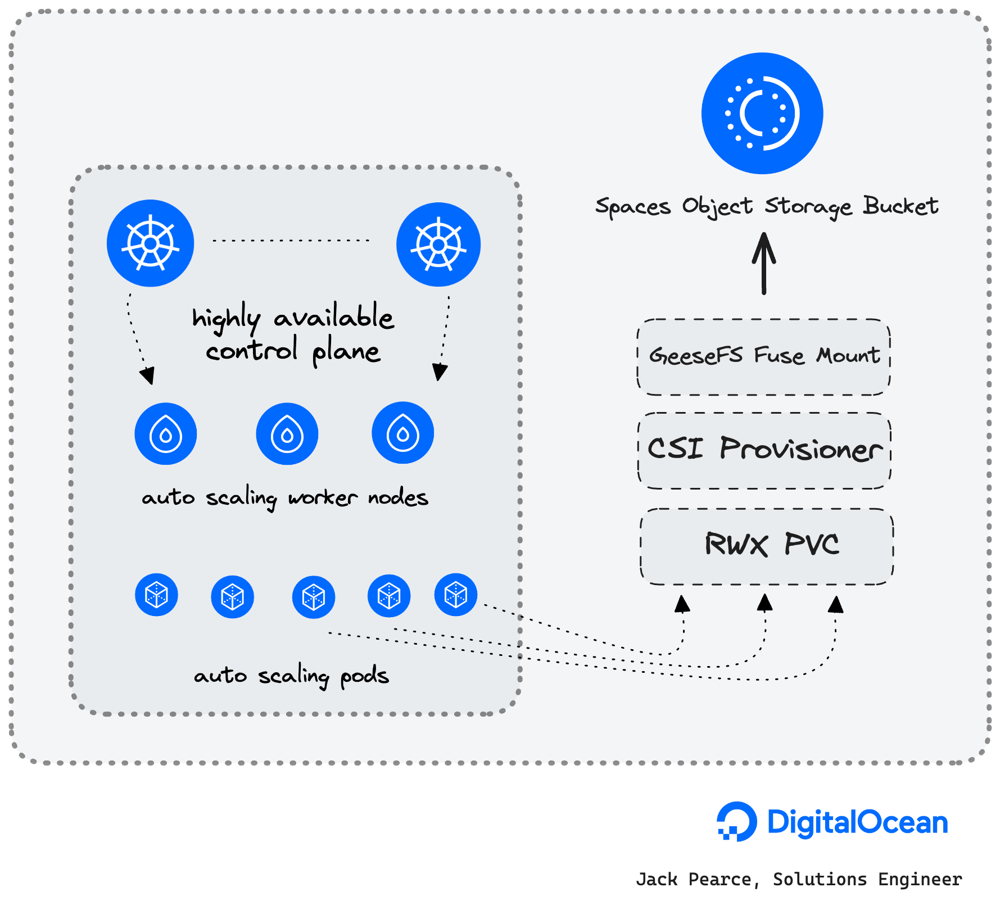
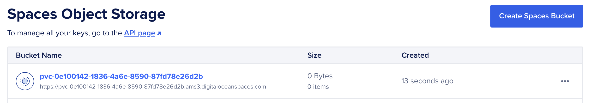
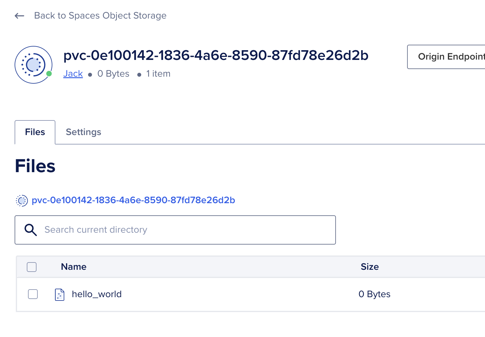

# k8s-csi-s3

[k8s-csi-s3](https://github.com/yandex-cloud/k8s-csi-s3) allows you to use a DigitalOcean Spaces Object Storage bucket as ReadWriteMany (RWX) storage for a Kubernetes Pod with DOKS (DigitalOcean Kubernetes). By default, csi-s3 will create a new bucket per volume. The bucket name will match that of the volume ID. Under the hood it uses [GeeseFS](https://github.com/yandex-cloud/geesefs) which allows you to mount an S3 bucket as a file system.

**Prerequisites**

1. A DigitalOcean [Spaces Object Storage subscription](https://docs.digitalocean.com/products/spaces/how-to/create/)
2. A Spaces [API Access Key](https://docs.digitalocean.com/products/spaces/how-to/manage-access/#access-keys)

**Note:** As S3 is not a real file system there are some [limitations](https://github.com/yandex-cloud/geesefs#posix-compatibility-matrix) to consider.

> *[DigitalOcean Spaces Object Storage](https://www.digitalocean.com/products/spaces) is an S3-compatible object storage service that lets you store and serve large amounts of data. Each Space is a bucket for you to store and serve files. The built-in Spaces CDN minimizes page load times and improves performance.*

## About GeeseFS

> *Finally, an exemplary FUSE FS implementation over S3*

- [GeeseFS](https://github.com/yandex-cloud/geesefs) allows you to mount an S3 bucket as a file system.
- FUSE file systems based on S3 typically have performance problems, especially with small files and metadata operations.
- GeeseFS **attempts to solve these problems** by using aggressive parallelism and asynchrony.
- GeeseFS is stable enough to pass most applicable xfstests, including dirstress/fsstress stress-tests (generic/007, generic/011, generic/013).
- [Benchmarks](#Benchmarks) compared to rclone+cache, goofys and s3fs.

## k8s-csi-s3 Diagram

The following diagram shows how k8s-csi-s3 works on a DigitalOcean Kubernetes cluster (DOKS) (based on the example used in the getting started section):



## Software included


| Package    | License                                                                      |
| ------------ | ------------------------------------------------------------------------------ |
| k8s-csi-s3 | [Apache 2.0](https://github.com/yandex-cloud/k8s-csi-s3/blob/master/LICENSE) |

## Getting Started

You can connect to your DigitalOcean Kubernetes cluster by following our [how-to guide](https://www.digitalocean.com/docs/kubernetes/how-to/connect-to-cluster).

### Using k8s-csi-s3 for the first time

1. First, let's check that the 1-Click deployed succesfully with: `kubectl get storageclasses.storage.k8s.io --output name`, we should see a new StorageClass called `csi-s3`

```text
storageclass.storage.k8s.io/csi-s3
storageclass.storage.k8s.io/do-block-storage
storageclass.storage.k8s.io/do-block-storage-retain
storageclass.storage.k8s.io/do-block-storage-xfs
storageclass.storage.k8s.io/do-block-storage-xfs-retain
```

2. Create a secret in your cluster to enable k8s-csi-s3 to authenticate with your DigitalOcean Spaces account

Update the `endpoint` URL to match the region of your DOKS cluster (or the nearest Spaces region). For optimal performance, ensure that your DOKS cluster and Spaces buckets are located in the same region to minimize latency.

Spaces availability per region is detailed [here.](https://docs.digitalocean.com/products/platform/availability-matrix/#other-product-availability)

`kubectl apply -f secret.yaml --force`

```yaml
apiVersion: v1
kind: Secret
metadata:
  name: csi-s3-secret
  namespace: csi-s3
stringData:
  accessKeyID: <YOUR_ACCESS_KEY_ID>
  secretAccessKey: <YOUR_SECRET_ACCESS_KEY>
  endpoint: https://ams3.digitaloceanspaces.com
```

### Using k8s-csi-s3 with your workloads

#### Deploy an example PVC

Create a Dynamically provisioned PVC using the new storage class. A DigitalOcean Spaces bucket will be created automatically for the PV and removed when the PV is removed.

`kubectl create -f https://raw.githubusercontent.com/digitalocean/marketplace-kubernetes/master/stacks/csi-s3/assets/examples/pvc.yaml`

```yaml
apiVersion: v1
kind: PersistentVolumeClaim
metadata:
  name: csi-s3-pvc
  namespace: default
spec:
  accessModes:
  - ReadWriteMany
  resources:
    requests:
      storage: 5Gi
  storageClassName: csi-s3
```

Check if the PVC has been bound with `kubectl get pvc csi-s3-pvc`

```text
NAME         STATUS   VOLUME                                     CAPACITY   ACCESS MODES   STORAGECLASS   VOLUMEATTRIBUTESCLASS   AGE
csi-s3-pvc   Bound    pvc-0e100142-1836-4a6e-8590-87fd78e26d2b   5Gi        RWX            csi-s3         <unset>                 31m
```

At this stage you'll see a new bucket created in your DigitalOcean account:



And you'll see the S3 bucket created in the provisioner logs `kubectl logs -l app=csi-s3-provisioner -c csi-s3 -n kube-system`

```text
Defaulted container "csi-provisioner" out of: csi-provisioner, csi-s3
I0615 14:31:09.754459       1 reflector.go:255] Listing and watching *v1.PersistentVolume from sigs.k8s.io/sig-storage-lib-external-provisioner/v6/controller/controller.go:872
I0615 14:31:09.853777       1 shared_informer.go:270] caches populated
I0615 14:31:09.854955       1 controller.go:887] Started provisioner controller ru.yandex.s3.csi_csi-s3-provisioner-0_c9b0cf7a-ff61-4d4b-9344-06d5c82f050b!
I0615 14:34:27.162321       1 controller.go:1335] provision "default/csi-s3-pvc" class "csi-s3": started
I0615 14:34:27.163188       1 event.go:282] Event(v1.ObjectReference{Kind:"PersistentVolumeClaim", Namespace:"default", Name:"csi-s3-pvc", UID:"fcf035ac-7942-4708-a187-e209c411c5e1", APIVersion:"v1", ResourceVersion:"3581", FieldPath:""}): type: 'Normal' reason: 'Provisioning' External provisioner is provisioning volume for claim "default/csi-s3-pvc"
I0615 14:34:34.140206       1 controller.go:762] create volume rep: {CapacityBytes:5368709120 VolumeId:pvc-fcf035ac-7942-4708-a187-e209c411c5e1 VolumeContext:map[capacity:5368709120 mounter:geesefs options:--memory-limit 1000 --dir-mode 0777 --file-mode 0666] ContentSource:<nil> AccessibleTopology:[] XXX_NoUnkeyedLiteral:{} XXX_unrecognized:[] XXX_sizecache:0}
I0615 14:34:34.140450       1 controller.go:838] successfully created PV pvc-fcf035ac-7942-4708-a187-e209c411c5e1 for PVC csi-s3-pvc and csi volume name pvc-fcf035ac-7942-4708-a187-e209c411c5e1
I0615 14:34:34.140637       1 controller.go:1442] provision "default/csi-s3-pvc" class "csi-s3": volume "pvc-fcf035ac-7942-4708-a187-e209c411c5e1" provisioned
I0615 14:34:34.140778       1 controller.go:1459] provision "default/csi-s3-pvc" class "csi-s3": succeeded
I0615 14:34:34.155331       1 event.go:282] Event(v1.ObjectReference{Kind:"PersistentVolumeClaim", Namespace:"default", Name:"csi-s3-pvc", UID:"fcf035ac-7942-4708-a187-e209c411c5e1", APIVersion:"v1", ResourceVersion:"3581", FieldPath:""}): type: 'Normal' reason: 'ProvisioningSucceeded' Successfully provisioned volume pvc-fcf035ac-7942-4708-a187-e209c411c5e1
```

#### Deploy an example Pod

1. Create a test pod that mounts your volume: `kubectl create -f https://raw.githubusercontent.com/digitalocean/marketplace-kubernetes/master/stacks/csi-s3/assets/examples/pod.yaml`

```yaml
apiVersion: v1
kind: Pod
metadata:
  name: csi-s3-test-nginx
  namespace: default
spec:
  containers:
   - name: csi-s3-test-nginx
     image: nginx
     volumeMounts:
       - mountPath: /usr/share/nginx/html/s3
         name: webroot
  volumes:
   - name: webroot
     persistentVolumeClaim:
       claimName: csi-s3-pvc
       readOnly: false
```

If the pod can start, everything should be working.

2. Test the mount

```bash
kubectl exec -it pod/csi-s3-test-nginx -- bash
mount | grep fuse
```

```text
pvc-035763df-0488-4941-9a34-f637292eb95c: on /usr/share/nginx/html/s3 type fuse.geesefs (rw,nosuid,nodev,relatime,user_id=65534,group_id=0,default_permissions,allow_other)
```

`touch /usr/share/nginx/html/s3/hello_world`

You'll see a blank `hello_world` created in your bucket:



**For additional configuration options such as using an existing bucket see: [Additional Configuration](https://github.com/yandex-cloud/k8s-csi-s3/tree/master?tab=readme-ov-file#additional-configuration)**

## Benchmarks

Spaces Object Storage limits are [detailed here](https://docs.digitalocean.com/products/spaces/details/limits/)

### Tests using `dd` and `fio`

- Use[`gen_small.py`](https://github.com/yandex-cloud/geesefs/blob/master/bench/gen_small.py) to create 6400 files, sized 0.5-300KB, 30KB on average, sharded over 1024 dirs with 2 level deep nesting
  - Copy this directory
  - Delete this directory
- Write 1GB and 5GB files to Spaces Object Storage
- Read 1GB and 5GB files from Spaces Object Storage


| Test                 | Command                                                      | Time      | Detail    |
| ---------------------- | -------------------------------------------------------------- | ----------- | ----------- |
| Create 6400 files    | python3 gen_small.py /mnt/s3/test1                           | 11.3 s    |           |
| Copy the directory   | cp -r test1 test2                                            | 7.8 s     |           |
| Delete the directory | rm -r test1                                                  | 1.2 s     |           |
| Write 1GB            | dd if=/dev/zero of=largefile bs=1MB count=1000 oflag=direct  | 6.8215 s  | 147 MB/s  |
| Read 1GB             | dd if=largefile of=/dev/null bs=1MB iflag=direct             | 2.02862 s | 493 MB/s  |
| Write 5GB            | dd if=/dev/zero of=largefile5 bs=1MB count=5000 oflag=direct | 56.2905 s | 88.8 MB/s |
| Read 5GB             | dd if=largefile5 of=/dev/null bs=1MB iflag=direct            | 7.60369 s | 658 MB/s  |

### Dbench

Benchmarks ran using [dbench](https://github.com/jkpedo/dbench/tree/doks)

#### Native volume benchmarks

Below are the results of an `s-2vcpu-4gb-amd` worker node with a 1TB Volume attached using the `do-block-storage` storageClass

```text
==================
= Dbench Summary =
==================
Random Read/Write IOPS: 9986/9987. BW: 384MiB/s / 387MiB/s
Average Latency (usec) Read/Write: 750.36/399.11
Sequential Read/Write: 384MiB/s / 395MiB/s
Mixed Random Read/Write IOPS: 7515/2471
```

#### S3 benchmarks

```text
==================
= Dbench Summary =
==================
Random Read/Write IOPS: 126/1431. BW: 15.4MiB/s / 47.2MiB/s
Average Latency (ms) Read/Write: 36.1/3.1
Sequential Read/Write: 64.9MiB/s / 61.2MiB/s
Mixed Random Read/Write IOPS: 46/14
```

## Upgrade instructions

`helm repo update`
`helm upgrade csi-s3 yandex-s3/csi-s3 --namespace csi-s3`

## Uninstall instructions

`helm uninstall csi-s3 --namespace csi-s3`
