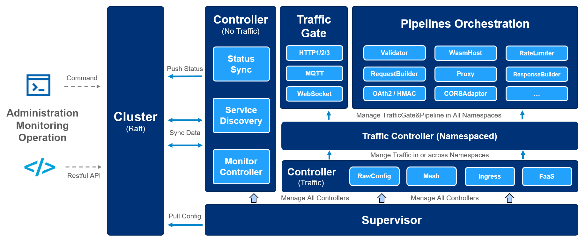

# Description

[Easegress](https://megaease.com/easegress) is a Cloud Native traffic orchestration system designed for:

- **High Availability:** Built-in Raft consensus & leader election provides 99.99% availability.
- **Traffic Orchestration:** Simple orchestration of various filters for each traffic pipeline.
- **High Performance:** Lightweight and essential features speed up the performance.
- **Observability:** There are many meaningful statistics periodically in a readable way.
- **Extensibility:** It's easy to develop your own filter or controller with high-level programming language.
- **Integration:** The simple interfaces make it easy to integrate with other systems, such as Kubernetes Ingress, [EaseMesh](https://github.com/megaease/easemesh) sidecar, Workflow, etc.

## Easegress Architecture Overview



## Software Included

| Package   | Easegress Version                                        | Helm Chart Version                                                                      | License                                                            |
|-----------|----------------------------------------------------------|-----------------------------------------------------------------------------------------|--------------------------------------------------------------------|
| Easegress | [latest](https://github.com/megaease/easegress/releases) | [1.0.0](https://github.com/megaease/easegress-helm-charts/releases/tag/easegress-1.0.0) | [Apache 2.0](https://github.com/apache/pulsar/blob/master/LICENSE) |

## Getting Started

### How to Connect to Your Cluster

Follow these [instructions](https://www.digitalocean.com/docs/kubernetes/how-to/connect-to-cluster/) to connect to your cluster with `kubectl` and `doctl`.

### Confirming that Easegress is Running

First, check if the Helm installation was successful by running the command below:

```console
helm ls -n easegress
```

The output looks similar to the following:

```text
NAME     	NAMESPACE	REVISION	UPDATED                               	STATUS  	CHART          	APP VERSION
easegress	easegress	1       	2023-09-19 02:42:24.14856881 +0000 UTC	deployed	easegress-1.0.0	2.6.1
```

The `STATUS` column value should be `deployed`.

Next, verify if Easegress pods are up and running:

```console
kubectl get pods -n easegress
```

The output looks similar to the following:

```text
NAME          READY   STATUS    RESTARTS   AGE
easegress-0   1/1     Running   0          105s
```

All pods should be in a `READY` state with a `STATUS` of `Running`.

### Tweaking Helm Chart Values

The Easegress stack provides some custom values to start with. See the [values](./values.yml) file from the main GitHub repository for more information.

You can inspect all the available options, as well as the default values for the Easegress Helm chart by running the following command:

```console
helm show values easegress/easegress --version 1.0.0
```

After customizing the Helm values file (`values.yml`), you can apply the changes via the `helm upgrade` command, as shown below:

```console
helm upgrade easegress easegress/easegress --version 1.0.0 \
  --namespace easegress \
  --values values.yml
```

### Verifying the Easegress Setup

To verify that Easegress is running, you can create a basic ingress controller and check if it is working properly.

First, attach in a shell session to the Easegress pod:

```console
k -n easegress exec -ti easegress-0 /bin/sh
```

You can see the client tools in the `/opt/easegress/bin` directory:

```text
/opt/easegress # ls bin/
easegress-server  egbuilder         egctl
```

Then, create an ingress controller, it handles ingresses from all K8s namespaces when namespaces is an empty array.

```Shell
echo '
kind: IngressController
name: ingress-controller-example
namespaces: []                             # Keep the value an empty array
httpServer:
  port: 8080
  https: false
  keepAlive: true
  keepAliveTimeout: 60s
  maxConnections: 10240
' | ./bin/egctl create -f -
```

Check if the ingress controller is created successfully:

```Text
/opt/easegress # ./bin/egctl object list
- createdAt: "2023-09-19T07:50:07Z"
  httpServer:
    accessLogFormat: ""
    autoCert: false
    caCertBase64: ""
    cacheSize: 0
    certBase64: ""
    certs: null
    clientMaxBodySize: 0
    http3: false
    https: false
    keepAlive: true
    keepAliveTimeout: 60s
    keyBase64: ""
    keys: null
    maxConnections: 10240
    port: 8080
    rules: null
    xForwardedFor: false
  ingressClass: easegress
  kind: IngressController
  kubeConfig: ""
  masterURL: ""
  name: ingress-controller-example
  namespaces: []
  version: easegress.megaease.com/v2
```

Then, **log out of the Easegress pod**, and create two versions of hello service in Kubernetes:

```Shell
echo '
---
apiVersion: apps/v1
kind: Deployment
metadata:
  name: hello-deployment
spec:
  selector:
    matchLabels:
      app: products
      department: sales
  replicas: 2
  template:
    metadata:
      labels:
        app: products
        department: sales
    spec:
      containers:
      - name: hello-v1
        image: "us-docker.pkg.dev/google-samples/containers/gke/hello-app:1.0"
        env:
        - name: "PORT"
          value: "50001"
      - name: hello-v2
        image: "us-docker.pkg.dev/google-samples/containers/gke/hello-app:2.0"
        env:
        - name: "PORT"
          value: "50002"

---
apiVersion: v1
kind: Service
metadata:
  name: hello-service
spec:
  type: NodePort
  selector:
    app: products
    department: sales
  ports:
  - name: port-v1
    protocol: TCP
    port: 60001
    targetPort: 50001
  - name: port-v2
    protocol: TCP
    port: 60002
    targetPort: 50002
' | kubectl apply -f -
```

Check if the hello pods and services are created successfully:

```Text
kubectl get pods
NAME                                              READY   STATUS    RESTARTS   AGE
hello-deployment-5657495f59-85gb2                 2/2     Running   0          69m
hello-deployment-5657495f59-x7b5x                 2/2     Running   0          69m

kubectl get svc
NAME                             TYPE       CLUSTER-IP      EXTERNAL-IP   PORT(S)                           AGE
hello-service                    NodePort   10.233.16.71    <none>        60001:30514/TCP,60002:32051/TCP   69m
```

Create a Kubernetes ingress for the two services, note the ingressClassName is easegress:

```Shell
echo '
apiVersion: networking.k8s.io/v1
kind: Ingress
metadata:
  name: ingress-example
spec:
  ingressClassName: easegress
  rules:
  - host: "www.example.com"
    http:
      paths:
      - pathType: Prefix
        path: /
        backend:
          service:
            name: hello-service
            port:
              number: 60001
  - host: "*.megaease.com"
    http:
      paths:
      - pathType: Prefix
        path: /
        backend:
          service:
            name: hello-service
            port:
              number: 60002
' | kubectl apply -f -
```

Check if the ingress is created successfully:

```Text
kubectl get ingress
NAME              CLASS       HOSTS                            ADDRESS   PORTS   AGE
ingress-example   easegress   www.example.com,*.megaease.com             80      70m
```

After a while, we can leverage the below command to access both versions of the hello application:

```text
$ curl http://<NODE_IP>:<NODE_PORT> -HHost:www.megaease.com
Hello, world!
Version: 2.0.0
Hostname: hello-deployment-5657495f59-x7b5x

curl http://<NODE_IP>:<NODE_PORT> -HHost:www.example.com
Hello, world!
Version: 1.0.0
Hostname: hello-deployment-5657495f59-x7b5x
```

* NOTE:

You can get the `NODE_IP` and `NODE_PORT` by running the following command:

```text
export NODE_PORT=$(kubectl get --namespace easegress -o jsonpath="{.spec.ports[0].nodePort}" services easegress)
export NODE_IP=$(kubectl get nodes --namespace easegress -o jsonpath="{.items[0].status.addresses[0].address}")
echo http://$NODE_IP:$NODE_PORT

http://10.108.162.15:30780
```

## Upgrading Easegress Stack

You can check what versions are available to upgrade, by navigating to the [Easegress-helm-chart](https://github.com/megaease/easegress-helm-charts/releases) releases page on GitHub.

Then, to upgrade the Easegress stack to a newer version, please run the following command, replacing the `<>` placeholders:

```console
helm upgrade easegress easegress/easegress \
  --version <EASEGRESS_NEW_VERSION> \
  --namespace easegress \
  --values <YOUR_EASEGRESS_HELM_VALUES_FILE>
```

See [helm upgrade](https://helm.sh/docs/helm/helm_upgrade/) for more information about the command. Also, please make sure the read

## Uninstalling Easegress Stack

To delete your installation of `easegress`, run the following command:

```console
helm uninstall easegress -n easegress
```

### Additional Resources

To study more about Easegress, you can visit the following topics:

- [Easegress Source Code](https://github.com/megaease/easegress)
- [Easegress Guideline](https://megaease.com/docs/easegress/)
