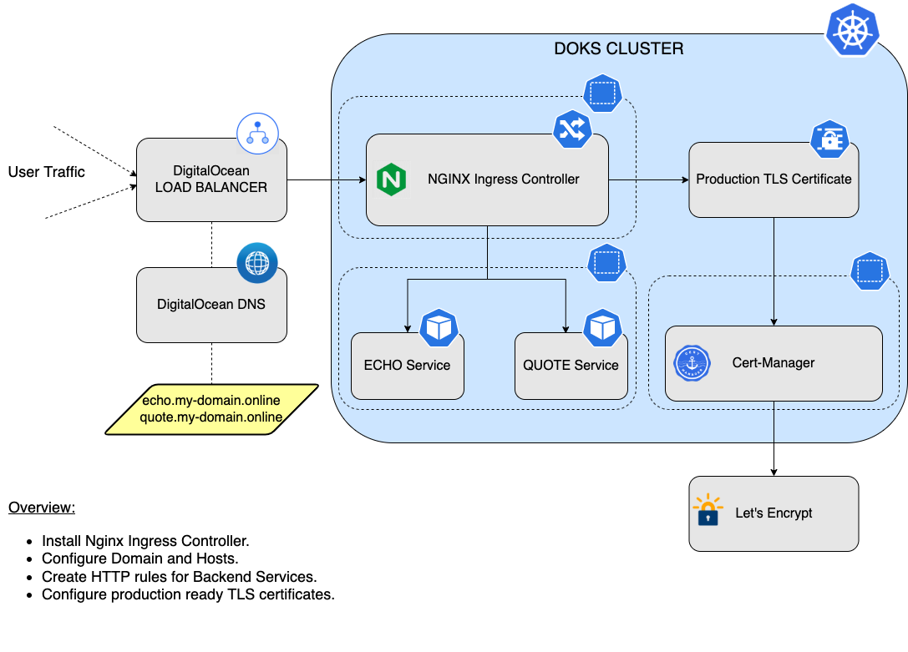

# Description

[NGINX](https://github.com/kubernetes/ingress-nginx/) is an Ingress Controller, and sits at the edge of your VPC acting as an entry point for your network. It operates at layer 7 of the OSI model and handles and routes HTTP requests to your web applications.

When NGINX is deployed to your DigitalOcean Kubernetes (DOKS) cluster, a Load Balancer is created as well, through which it receives the outside traffic. Then, you will have a domain set up with `A` type records (hosts), which in turn point to your load balancer's external IP. So, data flow goes like this: `User Request -> Host.DOMAIN -> Load Balancer -> Ingress Controller (NGINX) -> Backend Applications (Services)`.

In a real world scenario, you do not want to use one Load Balancer per service, so you need a proxy inside the cluster, which is provided by the Ingress Controller. As with every Ingress Controller, NGINX allows you to define ingress objects. Each ingress object contains a set of rules that define how to route external traffic (HTTP requests) to your backend services. For example, you can have multiple hosts defined under a single domain, and then let NGINX take care of routing traffic to the correct host.

The NGINX Ingress Controller is deployed via [Helm](https://helm.sh/) and can be managed the usual way.

To know more about the community maintained version of the NGINX Ingress Controller, check the [official Kubernetes documentation](https://kubernetes.github.io/ingress-nginx/).

**Notes:**

- DigitalOcean uses Helm v3 to deploy the NGINX Ingress Controller to your DOKS cluster.
- The NGINX Ingress Controller 1-Click App also includes a $12/month DigitalOcean Load Balancer to ensure that ingress traffic is distributed across all of the nodes in your DOKS cluster.

## NGINX Example Setup Diagram

Below is a diagram depicting a more complete example for an NGINX based setup:



 For setting up production-ready TLS certificates via Cert-Manager, see the [additional resources](#additional-resources) section.

## Software Included

| Package | Application Version | Helm Chart Version | License |
|---------|---------------------|--------------------| ------- |
| NGINX Ingress Controller | v1.2.1 | [4.1.3](https://github.com/kubernetes/ingress-nginx/tree/helm-chart-4.1.3/charts/ingress-nginx)  | [Apache 2.0](https://github.com/kubernetes/ingress-nginx/blob/main/LICENSE) |

## Getting Started

### Connecting to Your Cluster

Follow these [instructions](https://www.digitalocean.com/docs/kubernetes/how-to/connect-to-cluster/) to connect to your cluster with `kubectl` and `doctl`.

### Confirming that NGINX Ingress Controller is Running

First, check if the Helm installation was successful by running command below:

```console
helm ls -n ingress-nginx
```

The output looks similar to the following:

```text
NAME            NAMESPACE       REVISION        UPDATED                                 STATUS          CHART                   APP VERSION
ingress-nginx   ingress-nginx   1               2022-08-02 10:55:25.064553 +0300 EEST   deployed        ingress-nginx-4.1.3     1.2.1 
```

The `STATUS` column value should be `deployed`.

Next, verify if the NGINX Ingress Pods are up and running:

```console
kubectl get pods --all-namespaces -l app.kubernetes.io/name=ingress-nginx
```

The output looks similar to the following:

```text
NAMESPACE       NAME                                        READY   STATUS    RESTARTS   AGE
ingress-nginx   ingress-nginx-controller-664d8d6d67-6x4dd   1/1     Running   0          3m
ingress-nginx   ingress-nginx-controller-664d8d6d67-khm5x   1/1     Running   0          3m
```

All pods should be in a `READY` state, and `STATUS` should be `Running`.

Finally, inspect the external IP address of your NGINX Ingress Controller Load Balancer by running below command:

```console
kubectl get svc -n ingress-nginx
```

The output looks similar to the following:

```text
NAME                                 TYPE           CLUSTER-IP       EXTERNAL-IP     PORT(S)                      AGE
ingress-nginx-controller             LoadBalancer   10.245.156.128   67.207.70.117   80:31477/TCP,443:31171/TCP   3m
ingress-nginx-controller-admission   ClusterIP      10.245.18.58     <none>          443/TCP                      3m
ingress-nginx-controller-metrics     ClusterIP      10.245.193.76    <none>          10254/TCP                    3m
```

Check that the `EXTERNAL-IP` column has a valid IP address.

### Tweaking Helm Values

The NGINX Ingress stack provides some custom values to start with. See the [values](./values.yml) file from the main GitHub repository for more information.

You can inspect all the available options, as well as the default values for the NGINX Ingress Helm chart by running the following command:

```console
helm show values ingress-nginx/ingress-nginx --version 4.1.3
```

After customizing the Helm values file (`values.yml`), you can apply the changes via `helm upgrade` command, as shown below:

```console
helm upgrade ingress-nginx ingress-nginx/ingress-nginx --version 4.1.3 \
  --namespace ingress-nginx \
  --values values.yml
```

### Configuring NGINX Ingress Rules for Backend Services

To expose backend applications (services) to the outside world, you specify the mapping between the hosts and services in your Ingress Controller. NGINX follows a simple pattern in which you define a set of rules. Each rule associates a host to a backend service via a corresponding path `prefix`.

Typical ingress resource for NGINX looks like below:

```yaml
apiVersion: networking.k8s.io/v1
kind: Ingress
metadata:
  name: ingress-echo
  namespace: backend
spec:
  ingressClassName: nginx
  rules:
    - host: echo.starter-kit.online
      http:
        paths:
          - path: /
            pathType: Prefix
            backend:
              service:
                name: echo
                port:
                  number: 8080
```

Explanations for the above configuration:

- `spec.rules`: A list of host rules used to configure the Ingress. If unspecified, or no rule matches, all traffic is sent to the default backend.
- `spec.rules.host`: Host is the fully qualified domain name of a network host (e.g.: `echo.starter-kit.online`).
- `spec.rules.http`: List of http selectors pointing to backends.
- `spec.rules.http.paths`: A collection of paths that map requests to backends. In the above example the `/` path prefix is matched with the `echo` backend `service`, running on port `8080`.

The above ingress resource tells NGINX to route each HTTP request that is using the `/` prefix for the `echo.starter-kit.online` host, to the `echo` backend service running on port `8080`. In other words, every time you make a call to `http://echo.starter-kit.online/` the request and reply will be served by the `echo` backend service running on port `8080`.

## Upgrading the NGINX Ingress Chart

You can check what versions are available to upgrade, by navigating to the [ingress-nginx](https://github.com/kubernetes/ingress-nginx/releases) official releases page on GitHub. Alternatively, you can also use [ArtifactHUB](https://artifacthub.io/packages/helm/ingress-nginx/ingress-nginx).

Then, to upgrade the stack to a newer version, run the following command, replacing the `<>` placeholders:

```console
helm upgrade ingress-nginx ingress-nginx/ingress-nginx \
  --version <INGRESS_NGINX_STACK_NEW_VERSION> \
  --namespace ingress-nginx \
  --values <YOUR_HELM_VALUES_FILE>
```

See [helm upgrade](https://helm.sh/docs/helm/helm_upgrade/) for more information about the command.

## Upgrading With Zero Downtime in Production

By default, the ingress-nginx controller has service interruptions whenever it's pods are restarted or redeployed. In order to fix that, see [this blog post](https://medium.com/codecademy-engineering/kubernetes-nginx-and-zero-downtime-in-production-2c910c6a5ed8) by Lindsay Landry from Codecademy.

## Migrating from stable/nginx-ingress

There are two main ways to migrate a release from `stable/nginx-ingress` to `ingress-nginx/ingress-nginx` chart:

1. For NGINX Ingress controllers used for non-critical services, the easiest method is to uninstall the old release and install the new one.
2. For critical services in production that require zero-downtime, you will want to:

- Install a second Ingress controller.
- Redirect your DNS traffic from the old controller to the new controller.
- Log traffic from both controllers during this changeover.
- Uninstall the old controller once traffic has fully drained from it.

For details, see [Upgrading With Zero Downtime in Production](#upgrading-with-zero-downtime-in-production).

## Uninstalling the NGINX Ingress Controller

To delete your installation of NGINX Ingress Controller, run the following command:

```console
helm uninstall ingress-nginx -n ingress-nginx
```

**Note:**

The command will delete all the associated Kubernetes resources installed by the `ingress-nginx` Helm chart, except the namespace itself. To delete the `ingress-nginx namespace` as well, please run below command:

```console
kubectl delete ns ingress-nginx
```

### Additional Resources

For further study, see the [Starter Kit](https://github.com/digitalocean/Kubernetes-Starter-Kit-Developers/) provided by DigitalOcean. Specifically, for more information on [NGINX](https://github.com/digitalocean/Kubernetes-Starter-Kit-Developers/blob/main/03-setup-ingress-controller/nginx.md), see the following:

- [Configuring DNS for the NGINX Ingress Controller](https://github.com/digitalocean/Kubernetes-Starter-Kit-Developers/blob/main/03-setup-ingress-controller/nginx.md#step-2---configuring-dns-for-nginx-ingress-controller).
- [Creating some sample backend services to start with](https://github.com/digitalocean/Kubernetes-Starter-Kit-Developers/blob/main/03-setup-ingress-controller/nginx.md#step-3---creating-the-nginx-backend-services).
- [Configuring Ingress Rules for the sample backend services](https://github.com/digitalocean/Kubernetes-Starter-Kit-Developers/blob/main/03-setup-ingress-controller/nginx.md#step-4---configuring-nginx-ingress-rules-for-backend-services).
- [Configuring production ready TLS certificates for your NGINX Ingress Controller](https://github.com/digitalocean/Kubernetes-Starter-Kit-Developers/blob/main/03-setup-ingress-controller/nginx.md#step-5---configuring-production-ready-tls-certificates-for-nginx).
- [Enabling Proxy Protocol for your NGINX Ingress setup](https://github.com/digitalocean/Kubernetes-Starter-Kit-Developers/blob/main/03-setup-ingress-controller/nginx.md#step-6---enabling-proxy-protocol).

To further enrich your experience, we also provide the following extra guides:

- [Setting up wildcard certificates for NGINX Ingress](https://github.com/digitalocean/Kubernetes-Starter-Kit-Developers/blob/main/03-setup-ingress-controller/guides/wildcard_certificates.md).
- [Ingress Controller Load Balancer migration](https://github.com/digitalocean/Kubernetes-Starter-Kit-Developers/blob/main/03-setup-ingress-controller/guides/ingress_loadbalancer_migration.md).
- [Performance considerations for NGINX](https://github.com/digitalocean/Kubernetes-Starter-Kit-Developers/blob/main/03-setup-ingress-controller/guides/nginx_performance_considerations.md).
