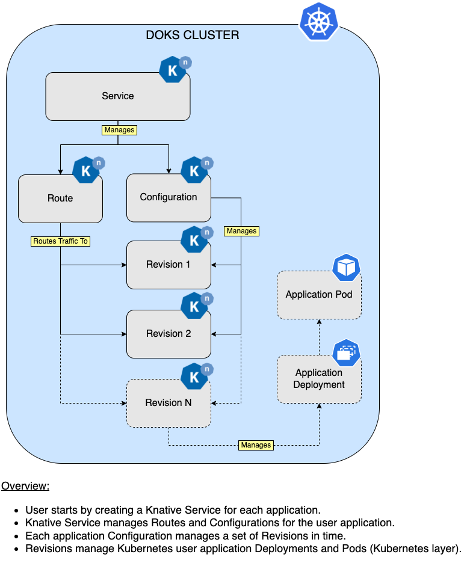
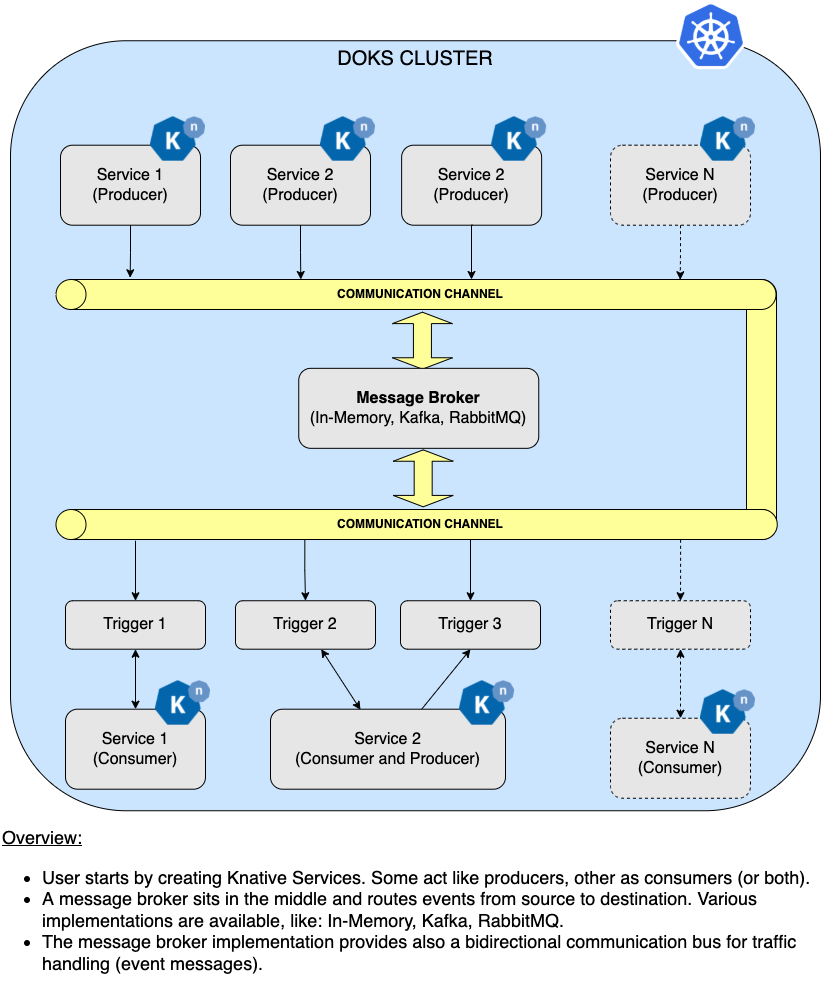

# Description

Most if not all of the time, developers need to focus and deal with infrastructure tasks as well, besides application development. Nowadays, when `Kubernetes` is the king, more and more people want to take advantage of its features. Pretty soon, you discover that maintaining Kubernetes manifests to deal with application deployment tasks, rolling back to a previous revision when something goes wrong, traffic routing, scaling up or down workloads to meet load demand, etc. can become a challenging task.

Meet [Knative](https://knative.dev), an open source solution empowering users to build and deploy `serverless` applications in no time, using `Kubernetes` as the underlying platform. It cuts down all the boilerplate needed for spinning up workloads in `Kubernetes`, like creating `deployments`, `services`, `ingress` objects, etc. And, it doesn't stop there. `Knative` is also about implementing `best practices` in production systems (e.g. blue-green, canary deployments), helps with application `observability` (logs and metrics), and adds support for `event driven` applications.

`Knative` is comprised of two main components:

- [Serving](https://knative.dev/docs/serving): Abstracts all required parts needed for your application to run and be accessible to the outside world.
- [Eventing](https://knative.dev/docs/eventing): Adds support for event based programming, thus making it easy to create event driven architectures.

`Knative Serving` features:

- Deploy serverless applications quickly.
- Autoscaling for application pods (down scaling to zero is supported).
- Point in time snapshots for application code and configurations (via revisions).
- Routing and network programming. Supports multiple networking layers, like: [Kourier](https://github.com/knative-sandbox/net-kourier), [Contour](https://projectcontour.io), [Istio](https://istio.io).

`Knative Eventing` was designed to address common tasks for `cloud native development`, like:

- Enabling late-binding for event sources and consumers.
- Loose coupling between services, thus making easy to deploy individual application components.
- Various services can be connected without modifying consumers or producers, thus facilitating building new applications.

## Knative Serving Overview Diagram

Below diagram is a simplified overview of how `Knative Serving` works:



**Notes:**

- `DigitalOcean` uses the [Knative Operator](https://github.com/knative/operator) to deploy `Knative` and required components (`Serving` and `Eventing`) to your `DOKS` cluster.
- The `Knative 1-Click App` is deploying `Kourier` as the default `Ingress Controller` for Knative.
- The `Knative 1-Click App` also includes a `$10/month DigitalOcean Load Balancer` to ensure that ingress traffic is distributed across all Knative services.

## Requirements

Minimum system requirements for `Knative` are as follows:

- A `DOKS` cluster running `Kubernetes version 1.21`.
- A `DOKS` cluster with 2 nodes, each having `2 CPUs`, `4 GB of memory`, and `20 GB of disk storage`.

## Software Included

| Package | Application Version | License |
|---------|---------------------|---------|
| Knative Operator | [1.2.2](https://github.com/knative/operator/releases/tag/knative-v1.2.2) | [Apache 2.0](https://github.com/knative/operator/blob/main/LICENSE) |
| Knative Serving | [1.2.3](https://github.com/knative/serving/releases/tag/knative-v1.2.3) | [Apache 2.0](https://github.com/knative/serving/blob/main/LICENSE) |
| Knative Eventing | [0.26.3](https://github.com/knative/eventing/releases/tag/v0.26.3) | [Apache 2.0](https://github.com/knative/eventing/blob/main/LICENSE) |

## Getting Started

### Connecting to Your Cluster

Follow these [instructions](https://www.digitalocean.com/docs/kubernetes/how-to/connect-to-cluster/) to connect to your cluster with `kubectl` and `doctl`.

### Confirming Knative Operator is Running

First, check if the `Knative Operator` installation was successful by running command below:

```console
kubectl get deployment knative-operator
```

The output looks similar to the following:

```text
NAME               READY   UP-TO-DATE   AVAILABLE   AGE
knative-operator   1/1     1            1           85s
```

All `knative-operator` deployment pods should be up and running (check `READY` column value).

Finally, inspect `knative-operator` logs (and check for possible issues, if any):

```console
kubectl logs -f deploy/knative-operator
```

### Confirming that Knative Serving is Running

`Serving` is one of the main components of Knative. Please go ahead and check if it's running:

```console
kubectl get KnativeServing knative-serving -n knative-serving
```

The output looks similar to (`READY` column should have a value of `True`):

```text
NAME              VERSION   READY   REASON
knative-serving   1.2.3     True
```

Then, please run the following command to check if all `Knative Serving` deployments are healthy:

```console
kubectl get deployment -n knative-serving
```

The output looks similar to:

```text
NAME                     READY   UP-TO-DATE   AVAILABLE   AGE
3scale-kourier-gateway   1/1     1            1           3h17m
activator                1/1     1            1           3h17m
autoscaler               1/1     1            1           3h17m
autoscaler-hpa           1/1     1            1           3h17m
controller               1/1     1            1           3h17m
domain-mapping           1/1     1            1           3h17m
domainmapping-webhook    1/1     1            1           3h17m
net-kourier-controller   1/1     1            1           3h17m
webhook                  1/1     1            1           3h17m
```

All important application components, like: `autoscaler`, `controller`, `domain-mapping`, `net-kourier-controller`, etc. should be up and running. If some are failing to start, please check the affected component(s) events and logs.

### Confirming that Knative Eventing is Running

`Eventing` is another important component of Knative. Please go ahead and check if it's running:

```console
kubectl get KnativeEventing knative-eventing -n knative-eventing
```

The output looks similar to:

```text
NAME               VERSION   READY   REASON
knative-eventing   0.26.3    True
```

Then, please run the following command to check if all `Knative Eventing` deployments are healthy:

```console
kubectl get deployment -n knative-eventing
```

The output looks similar to:

```text
NAME                    READY   UP-TO-DATE   AVAILABLE   AGE
eventing-controller     1/1     1            1           3h21m
eventing-webhook        1/1     1            1           3h21m
imc-controller          1/1     1            1           3h21m
imc-dispatcher          1/1     1            1           3h21m
mt-broker-controller    1/1     1            1           3h21m
mt-broker-filter        1/1     1            1           3h21m
mt-broker-ingress       1/1     1            1           3h21m
pingsource-mt-adapter   0/0     0            0           3h21m
sugar-controller        1/1     1            1           3h21m
```

All important application components, like: `eventing-controller`, `imc-controller`, `mt-broker-controller`, `mt-broker-ingress`, etc. should be up and running. If some are failing to start, please check the affected component(s) events and logs.

### Configuring the Knative Operator

Every aspect of a Knative installation is managed by the `Knative Operator`. Configuration is kept using `ConfigMaps` prefixed using `config-`. System config maps are accessible from the same namespace where the operator was deployed (the `default` namespace, usually):

```console
kubectl get cm
```

The output looks similar to:

```text
NAME                   DATA   AGE
config-logging         1      41m
config-observability   1      41m
```

However, it's not advised to change Operator ConfigMaps manually. Every manual change will be automatically overwritten by the Knative Operator. The recommended way is via the associated `Serving` and `Eventing` components `CRD`. The Operator will take care of propagating the configuration settings automatically to the corresponding resource(s).

Also, before continuing with the next step, please make sure that [DNS](https://knative.dev/docs/install/operator/knative-with-operators/#configure-dns) is configured properly for your `Knative Operator` deployment.

### Configuring the Knative Serving Component

The `Knative Serving` component is responsible with creating and managing your `serverless` applications, as well as all the associated resources for routing network traffic (like ingress objects), autoscaling, etc. It also takes care of creating point in time snapshots for your application configuration and code, called [Revisions](https://github.com/knative/specs/blob/main/specs/serving/knative-api-specification-1.0.md#revision).

Typical `Serving CRD` configuration looks like below:

```yaml
apiVersion: operator.knative.dev/v1alpha1
kind: KnativeServing
metadata:
  name: knative-serving
spec:
  version: "1.2.3"
  ingress:
    kourier:
      enabled: true
  config:
    network:
      ingress-class: "kourier.ingress.networking.knative.dev"
```

Explanations for the above configuration:

- `spec.version`: Tells `Knative Operator` what version of `KnativeServing` to install in your `DOKS` cluster (e.g. `1.2.3`).
- `spec.ingress` and `spec.config.network`: Tells Knative what implementation to use for the networking layer (e.g. `Kourier`).

Above example tells `Knative` to use `Kourier` as the default networking implementation to handle ingress configuration. You're not limited to Kourier only, and you can also choose among other available options like `Istio` and `Contour`, for example. Please bear in mind that `Kourier` is the only option which comes `bundled` with `Knative`. For the other networking implementations mentioned earlier, you need to install the stacks separately (e.g. `Istio`).

**Important note:**

The `Knative Operator` only permits `upgrades` or `downgrades` by `one minor release version` at a time. For example, if the current `Knative Serving` deployment is version `0.22.0`, you must upgrade to `0.23.0` before upgrading to `0.24.0`.

Please visit [KnativeServing](https://knative.dev/docs/install/operator/configuring-serving-cr) CRD official documentation for more details and available options.

### Configuring the Knative Eventing Component

The `Knative Eventing` component empowers you to create event driven architectures. A typical example would be processing pipelines (e.g. `image processing`), where different components (or stages) respond to external events, and work together to deliver the final result. Based on the task that needs to be performed, a specific component (or set of components) listening for that particular event is triggered. Then, when the task is done, another event is fired signaling other components from the system that processing is done, and that results are ready to be consumed.

Event driven architectures allow loose coupling between components in the system. This has a tremendous advantage, meaning that new functionality can be added pretty easy, without interfering or breaking other components. The backbone for event based architectures is a so called `message broker`. Several implementations are available, the most popular ones being [Apache Kafka](https://kafka.apache.org) and [RabbitMQ](https://www.rabbitmq.com). Using brokers abstracts the details of event routing from the event producer and event consumer. In other words, applications need not to worry how a message (or event) travels from point A to B. The broker implementation takes care of all the details, and routes correctly each message (or event) from source to destination (or multiple destinations).

Typical `Eventing CRD` configuration looks like below:

```yaml
apiVersion: operator.knative.dev/v1alpha1
kind: KnativeEventing
metadata:
  name: knative-eventing
  namespace: knative-eventing
spec:
  version: "0.26.3"
```

The above configuration tells `Knative Operator` to install the `0.26.3` version of `KnativeEventing` component in your `DOKS` cluster, via the `spec.version` field. If no version is specified, then the latest one available is picked automatically. You can also configure other options like message broker configurations, resources requests and limits for the underlying containers, etc.

**Important note:**

The `Knative Operator` only permits `upgrades` or `downgrades` by one `minor release version` at a time. For example, if the current Knative Eventing deployment is version `0.18.x`, you must upgrade to `0.19.x` before upgrading to `0.20.x`.

Please visit [KnativeEventing](https://knative.dev/docs/install/operator/configuring-eventing-cr) CRD official documentation for more details and available options.

### Creating a Serverless Application via Knative

For every serverless application you create, a `Knative Service` CRD must be defined (not to be confused with the `Kubernetes Service` resource). Each `Knative Service` is handled by the `Knative Serving` component presented earlier. A `Knative Service` abstracts all the required implementation details for your application to run (e.g. Kubernetes deployments, exposing the application via Ingress objects, autoscaling, etc). In the end, you will be presented with a HTTP URL resource to access your custom application.

Knative has the ability to automatically scale down your applications to zero when not in use or idle (e.g. when no HTTP traffic is present). Thus, your applications are basically `serverless`.

Typical `Service CRD` configuration looks like below:

```yaml
apiVersion: serving.knative.dev/v1
kind: Service
metadata:
  name: hello
spec:
  template:
    metadata:
      name: hello-world
    spec:
      containers:
        - image: gcr.io/knative-samples/helloworld-go
          ports:
            - containerPort: 8080
          env:
            - name: TARGET
              value: "World"
```

Please go ahead and create the above service, using `kubectl` (a separate namespace called `knative-samples` is being created as well to observe the results better):

```console
kubectl create ns knative-samples

kubectl apply -f https://raw.githubusercontent.com/digitalocean/marketplace-kubernetes/master/stacks/knative/assets/manifests/serving-example.yaml -n knative-samples
```

Now, check if the Knative service was created and in a healthy state (`knative-samples` namespace is assumed):

```console
kubectl get services.serving.knative.dev -n knative-samples
```

The output looks similar to:

```text
NAME    URL                                        LATESTCREATED   LATESTREADY   READY   REASON
hello   http://hello.knative-samples.example.com   hello-world     hello-world   True 
```

**Hint:**

You can also install the [Knative CLI tool](https://knative.dev/docs/install/client/install-kn), and get more comprehensive output:

```text
kn service list -n knative-samples

# Sample output:
# NAME    URL                                        LATEST        AGE     CONDITIONS   READY   REASON
# hello   http://hello.knative-samples.example.com   hello-world   2m33s   3 OK / 3     True 
```

### Testing the Knative Service

Assuming that there's a valid [DNS](https://knative.dev/docs/install/operator/knative-with-operators/#configure-dns) set up, you should be able to access the link shown in the above `URL` column:

```console
curl http://hello.knative-samples.example.com
```

Running above command should display the now ubiquitous `Hello World!` message. Behind the scenes Knative automatically created for you all required resources for your custom application, like deployments, routes, revisions, etc.

**Hint:**

If you don't have a real DNS setup yet, you can quickly test the service by creating a local mapping in the `/etc/hosts` file. Please follow steps below:

1. Fetch the `public IP` of the DO load balancer created by the Kourier ingress deployment:

    ```console
    kubectl get svc/kourier -n knative-serving
    ```

    The output looks similar to (`EXTERNAL-IP` column gives you the `Kourier` ingress controller `public IP` address):

    ```text
    NAME      TYPE           CLUSTER-IP       EXTERNAL-IP       PORT(S)                      AGE
    kourier   LoadBalancer   10.245.147.203   188.166.137.187   80:30611/TCP,443:30228/TCP   47h
    ```

2. Create a new entry for your Knative service in the `/etc/hosts` file (please replace the `<>` placeholders accordingly):

    ```text
    <YOUR_KOURIER_INGRESS_PUBLIC_IP_HERE> hello.knative-samples.example.com
    ```

3. Finally, go ahead and test your service (please bear in mind that it takes several seconds for Knative to `cold start` your `serverless` application):

    ```console
    curl http://hello.knative-samples.example.com
    ```

Next, you can use the `kn` CLI to get specific information about each resource type:

- List available `services` from the `knative-samples` namespace:
  
```console
kn service list -n knative-samples
```

- List available `routes` for each service in the `knative-samples` namespace:

```console
kn route list -n knative-samples
```

- List available `revisions` for each service in the `knative-samples` namespace:

```console
kn revision list -n knative-sample
```

Please check the official documentation to see all available options for [Serving](https://knative.dev/docs/serving/#serving-resources) resources. Also, you can configure [custom domains](https://knative.dev/docs/serving/services/custom-domains) for your applications, and enable production ready TLS certificates support via [Cert-Manager](https://knative.dev/docs/install/installing-cert-manager).

## Taking Advantage of Knative Eventing to Develop Event Driven Applications

When creating event driven architectures, usually there are three main components involved:

1. Event `producers`. These are applications that fire specific events.
2. Event `consumers` (or `subscribers`), and the associated `triggers`. A `trigger` defines what events a consumer (or subscriber) should respond to.
3. A `broker` that knows how to route all events from source to destination.

In a nutshell, we have a system composed of event producers and consumers (or subscribers). Usually, consumers `filter events` and act on specific `triggers` only. Subscribers can also respond back with other events as well. A `broker` sits behind the scenes, acting like the backbone of the entire system. Its main job is to make sure that events are `routed` correctly from source to destination. Knative eventing offers support for `In-Memory brokers` (recommended for development and quick testing only), as well as third party implementations, like: `Apache Kafka`, `RabbitMQ`, etc.

Knative services can act like event producers and/or consumers. Acting both like a producer and consumer, allows the service in question to send back events as a response (a feature required by processing pipelines).

Below diagram gives you a quick overview of an event driven system:



Please follow the official documentation to create and test the Knative eventing feature, via the provided step by step [example](https://knative.dev/docs/eventing/getting-started).

## Upgrading Knative Components via the Operator

All Knative components (Serving, Eventing) are managed by the Operator installation. First, you need to check what versions are available for upgrade, by navigating to:

- [Knative Serving](https://github.com/knative/serving/releases), for the available `Serving` component releases.
- [Knative Eventing](https://github.com/knative/eventing/releases), for the available `Eventing` component releases.

Then, you need to adjust the `spec.version` field from the YAML manifest of respective Knative component. For `Knative Serving` goes like this (please replace the `<>` placeholders accordingly):

```yaml
apiVersion: operator.knative.dev/v1alpha1
kind: KnativeServing
metadata:
  name: knative-serving
  namespace: knative-serving
spec:
  version: "<new-version>"
...
```

For `Knative Eventing` goes like this (please replace the `<>` placeholders accordingly):

```yaml
apiVersion: operator.knative.dev/v1alpha1
kind: KnativeEventing
metadata:
  name: knative-eventing
  namespace: knative-eventing
spec:
  version: "<new-version>"
...
```

Finally, to upgrade each `Knative` component to a newer version, run the following commands, replacing the `<>` placeholders:

```console
kubectl apply -f <YOUR_KNATIVE_SERVING_MANIFEST_FILE>

kubectl apply -f <YOUR_KNATIVE_EVENTING_MANIFEST_FILE>
```

See [Upgrade via the Knative Operator Guide](https://knative.dev/docs/install/upgrade/upgrade-installation-with-operator) for more information on how to upgrade the components, as well as the allowed migration paths.

## Uninstalling Knative

Knative Operator prevents unsafe removal of Knative resources. Even if the Knative Serving and Knative Eventing resources are successfully removed, all the CRDs in Knative are still kept in the cluster. All your resources relying on Knative CRDs can still work.

Removing the `Knative Serving` resource:

```console
kubectl delete KnativeServing knative-serving -n knative-serving
```

Removing the `Knative Eventing` resource:

```console
kubectl delete KnativeEventing knative-eventing -n knative-eventing
```

Removing the `Knative Operator`:

```console
OPERATOR_VERSION="1.2.2"

kubectl delete -f "https://github.com/knative/operator/releases/download/knative-v${OPERATOR_VERSION}/operator.yaml"
```

Delete associated namespaces (including all custom resources):

```console
kubectl delete ns knative-serving

kubectl delete ns knative-eventing

kubectl delete ns knative-samples
```

### Additional Resources

Please check the following links, for other useful and cool stuff that you can do with `Knative`:

- [Knative Official Documentation](https://knative.dev/docs).
- [Knative Eventing - Getting Started](https://knative.dev/docs/getting-started/getting-started-eventing).
- [Knative Eventing Observability - Collecting Logs](https://knative.dev/docs/eventing/observability/logging/collecting-logs).
- [Knative Eventing Observability - Collecting Metrics](https://knative.dev/docs/eventing/observability/metrics/collecting-metrics).
- [Knative Serving Observability - Collecting Logs](https://knative.dev/docs/serving/observability/logging/collecting-logs).
- [Knative Serving Observability - Collecting Metrics](https://knative.dev/docs/serving/observability/metrics/collecting-metrics).
- [Knative Serving - Autoscaling Applications](https://knative.dev/docs/serving/autoscaling).
- [Knative Serving - Application Traffic Management](https://knative.dev/docs/serving/traffic-management).
- [Knative Services - Configure Resource Requests and Limits](https://knative.dev/docs/serving/services/configure-requests-limits-services).
