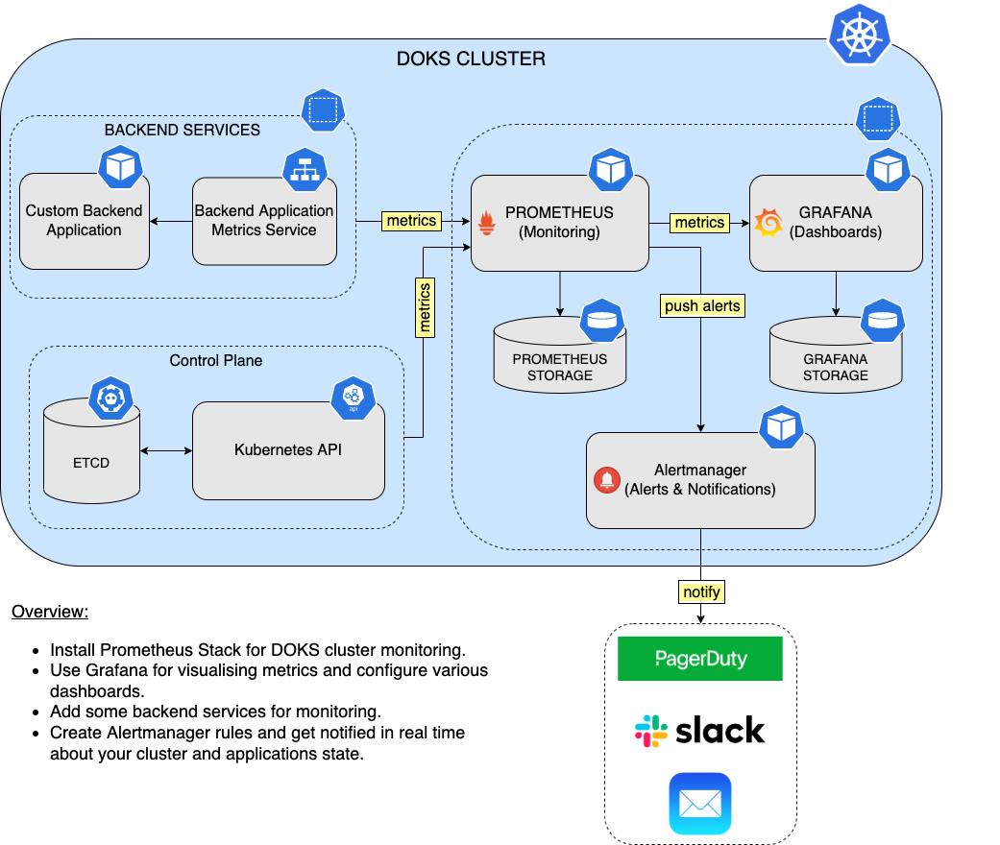

# Description

[Prometheus](https://prometheus.io/) is a very popular and comprehensive systems monitoring solution. It is a standalone open-source project and lets you monitor Kubernetes clusters as well. Prometheus eases the operational tasks that are required in setting up a monitoring stack.

The [kube-prometheus-stack](https://github.com/prometheus-community/helm-charts/tree/main/charts/kube-prometheus-stack/) is pre-configured to collect metrics from all Kubernetes components for cluster monitoring. In addition to that, it delivers a default set of dashboards and alerting rules. Many of the useful dashboards and alerts come from the [kubernetes-mixin](https://github.com/kubernetes-monitoring/kubernetes-mixin/) project.

The `kube-prometheus-stack` consists of three main components:

- Prometheus Operator - For spinning up and managing Prometheus instances in your DOKS cluster.
- Grafana - For visualizing metrics and plot data using dashboards.
- Alertmanager - For configuring various notifications. For example, PagerDuty, Slack, email, etc based on various alerts received from the Prometheus main server.

Prometheus follows a pull model for gathering metrics, meaning that it expects a `/metrics` endpoint to be exposed by the service in question for scraping. For every metric that is being fetched by Prometheus, a time-series database is used to store the data points.

Grafana helps you gather data points from the Prometheus time-series database, and plot everything using graphs grouped into dashboards. You can also perform queries using the PromQL language. To persist all the data (metrics and various settings), you need to allocate block storage for both Prometheus and Grafana instances via Persistent Volumes (or PVs).

The [Alertmanager](https://github.com/prometheus/alertmanager/) component handles alerts sent by client applications such as the Prometheus server. It takes care of deduplicating, grouping, and routing them to the correct receiver integration such as email, PagerDuty, or Slack. It can also silence and inhibit alerts.

See the following official documentation to learn more:

- [Prometheus](https://prometheus.io/docs/), to learn more about all the available features, as well as various configuration options.
- [Prometheus Operator](https://github.com/prometheus-operator/prometheus-operator/blob/main/Documentation/user-guides/getting-started.md), which provides useful information on how to use the operator.
- [Alertmanager](https://prometheus.io/docs/alerting/latest/alertmanager/), to learn more about Alertmanager and integrations with various notification platforms.

**Notes:**

- DigitalOcean uses Helm v3 to deploy Prometheus to your DOKS cluster.
- This chart was formerly named `prometheus-operator` chart, now renamed to more clearly reflect that it installs the `kube-prometheus` project stack, within which Prometheus Operator is only one component.
- The Prometheus 1-Click App also includes a $1/month block storage for both Grafana and Prometheus time-series database with two PVs of 5GB each.

## Prometheus Monitoring Overview Diagram

The diagram below shows a simple example for backend services monitoring, as well as fetching Kubernetes metrics (enabled by default via the `kube-prometheus-stack` Helm chart):



## Software Included

| Package | Prometheus Version | Prometheus Operator Version | Helm Chart Version | License |
|---------|--------------------|-----------------------------| ------------------ |-------- |
| Kubernetes Prometheus Stack | [2.32.1](https://github.com/prometheus/prometheus/releases/tag/v2.32.1) | [0.53.1](https://github.com/prometheus-operator/prometheus-operator/releases/tag/v0.53.1) | [30.0.1](https://github.com/prometheus-community/helm-charts/releases/tag/kube-prometheus-stack-30.0.1)  | [Apache 2.0](https://github.com/prometheus-operator/kube-prometheus/blob/main/LICENSE) |

## Getting Started

### How to Connect to Your Cluster

Follow these [instructions](https://www.digitalocean.com/docs/kubernetes/how-to/connect-to-cluster/) to connect to your cluster with `kubectl` and `doctl`.

### Confirming that Prometheus Monitoring Stack is Running

First, check if the Helm installation was successful by running the command below:

```console
helm ls -n kube-prometheus-stack
```

The output looks similar to the following:

```text
NAME                    NAMESPACE               REVISION  UPDATED               STATUS    CHART                         APP VERSION
kube-prometheus-stack   kube-prometheus-stack   1         2022-02-16 16:02:48   deployed  kube-prometheus-stack-30.0.1  0.53.1
```

The `STATUS` column value should be `deployed`.

Next, verify if the Prometheus stack pods are up and running:

```console
kubectl get pods -n kube-prometheus-stack
```

The output looks similar to the following:

```text
NAME                                                        READY   STATUS    RESTARTS   AGE
alertmanager-kube-prometheus-stack-alertmanager-0           2/2     Running   0          8m24s
kube-prometheus-stack-grafana-6f6fbc5cd9-7zbnl              3/3     Running   0          8m30s
kube-prometheus-stack-kube-state-metrics-596b9c6b55-zxpmn   1/1     Running   0          8m30s
kube-prometheus-stack-operator-7bb8679c95-mpdms             1/1     Running   0          8m30s
kube-prometheus-stack-prometheus-node-exporter-vzb5m        1/1     Running   0          8m30s
kube-prometheus-stack-prometheus-node-exporter-xz44k        1/1     Running   0          8m30s
prometheus-kube-prometheus-stack-prometheus-0               2/2     Running   0          8m24s
```

All pods should be in a `READY` state with a `STATUS` of `Running`.

### Accessing Prometheus Web Panel

You can access Prometheus web console by port forwarding the `kube-prometheus-stack-prometheus` service:

```console
kubectl port-forward svc/kube-prometheus-stack-prometheus 9090:9090 -n kube-prometheus-stack
```

Next, launch a web browser of your choice, and enter the following URL: http://localhost:9090. To see what targets were discovered by Prometheus, please navigate to http://localhost:9090/targets.

### Accessing Grafana Web Panel

You can connect to Grafana by port forwarding the `kube-prometheus-stack-grafana` service:

```console
kubectl port-forward svc/kube-prometheus-stack-grafana 3000:80 -n kube-prometheus-stack
```
Use the default credentials: `admin/prom-operator` as specified in the [values.yml](values.yml#L52)). 

Next, launch a web browser of your choice, and enter the following URL: http://localhost:3000. You can take a look around, and see what dashboards are available for you to use from the [kubernetes-mixin](https://github.com/kubernetes-monitoring/kubernetes-mixin) project as an example, by navigating to the following URL: http://localhost:3000/dashboards?tag=kubernetes-mixin.

### Tweaking Helm Chart Values

The `kube-prometheus-stack` provides some custom values to start with. See the [values](./values.yml) file from the main GitHub repository for more information.

You can inspect all the available options, as well as the default values for the `kube-prometheus-stack` Helm chart by running the following command:

```console
helm show values prometheus-community/kube-prometheus-stack --version 30.0.1
```

After customizing the Helm values file (`values.yml`), you can apply the changes via the `helm upgrade` command, as shown below:

```console
helm upgrade kube-prometheus-stack prometheus-community/kube-prometheus-stack --version 30.0.1 \
  --namespace kube-prometheus-stack \
  --values values.yml
```

### Configuring Service Monitors for Prometheus

To monitor applications in your cluster, you usually define a `ServiceMonitor` CRD. This is a custom resource definition provided by the Prometheus Operator, which helps you in the process of adding new services that need to be monitored.

A typical `ServiceMonitor` configuration looks like the following:

```yaml
apiVersion: monitoring.coreos.com/v1
kind: ServiceMonitor
metadata:
  name: example-app
  labels:
    team: frontend
spec:
  selector:
    matchLabels:
      app: example-app
  endpoints:
  - port: web
```

Explanations for the above configuration:

- `spec.selector.matchLabels.app`: Tells `ServiceMonitor` what application to monitor, based on a label.
- `spec.endpoints.port`: A reference to the port label used by the application that needs monitoring.

The [kube-prometheus-stack Helm values file](values.yml) provided in the GitHub repository, contains a section named `additionalServiceMonitors`, where you can define a list of additional services to monitor. For example, the snippet below sets up a NGINX Ingress Controller monitoring:

```yaml
additionalServiceMonitors:
  - name: "ingress-nginx-monitor"
    selector:
      matchLabels:
        app.kubernetes.io/name: ingress-nginx
    namespaceSelector:
      matchNames:
        - ingress-nginx
    endpoints:
      - port: "metrics"
```

After adding required services to monitor, you need to upgrade the stack via the `helm upgrade` command, in order to apply the changes:

```console
helm upgrade kube-prometheus-stack prometheus-community/kube-prometheus-stack \
  --version 30.0.1 \
  --namespace kube-prometheus-stack \
  --values values.yml
```

For the full list of available CRDs that you can use to control the Prometheus Operator, see [CRDs](https://github.com/prometheus-operator/prometheus-operator#customresourcedefinitions).

## Upgrading Kubernetes Prometheus Stack

You can check what versions are available to upgrade, by navigating to the [kube-prometheus-stack](https://github.com/prometheus-community/helm-charts/releases) official releases page on GitHub. Alternatively, you can also use [ArtifactHUB](https://artifacthub.io/packages/helm/prometheus-community/kube-prometheus-stack).

Then, to upgrade the stack to a newer version, please run the following command, replacing the `<>` placeholders:

```console
helm upgrade kube-prometheus-stack prometheus-community/kube-prometheus-stack \
  --version <KUBE_PROMETHEUS_STACK_NEW_VERSION> \
  --namespace kube-prometheus-stack \
  --values <YOUR_HELM_VALUES_FILE>
```

See [helm upgrade](https://helm.sh/docs/helm/helm_upgrade/) for more information about the command.

Also, check the official recommendations for the various [upgrade paths](https://github.com/prometheus-community/helm-charts/tree/main/charts/kube-prometheus-stack#upgrading-chart) from an existing release to a new major version of the Prometheus stack.

## Uninstalling Kubernetes Prometheus Stack

To delete your installation of `kube-prometheus-stack`, run the following command:

```console
helm uninstall kube-prometheus-stack -n kube-prometheus-stack
```

**Note:**

The command will delete all the associated Kubernetes resources installed by the `kube-prometheus-stack` Helm chart, except the namespace itself. To delete the `kube-prometheus-stack namespace` as well, run the following command:

```console
kubectl delete ns kube-prometheus-stack
```

### Additional Resources

For further study, see the [Starter Kit](https://github.com/digitalocean/Kubernetes-Starter-Kit-Developers/) provided by DigitalOcean. Specifically, for more information on [Prometheus](https://github.com/digitalocean/Kubernetes-Starter-Kit-Developers/tree/main/04-setup-prometheus-stack), see the following:

- [Configuring Prometheus and Grafana](https://github.com/digitalocean/Kubernetes-Starter-Kit-Developers/tree/main/04-setup-prometheus-stack#step-2---configure-prometheus-and-grafana).
- [Getting to Know PromQL](https://github.com/digitalocean/Kubernetes-Starter-Kit-Developers/tree/main/04-setup-prometheus-stack#step-3---promql-prometheus-query-language).
- [Visualizing Metrics using Grafana](https://github.com/digitalocean/Kubernetes-Starter-Kit-Developers/tree/main/04-setup-prometheus-stack#step-4---visualizing-metrics-using-grafana).
- [Best Practices for Prometheus PV Sizing](https://github.com/digitalocean/Kubernetes-Starter-Kit-Developers/tree/main/04-setup-prometheus-stack#best-practices-for-pv-sizing).

For more resources, see [media](https://prometheus.io/docs/introduction/media/) in the official Prometheus documentation.
