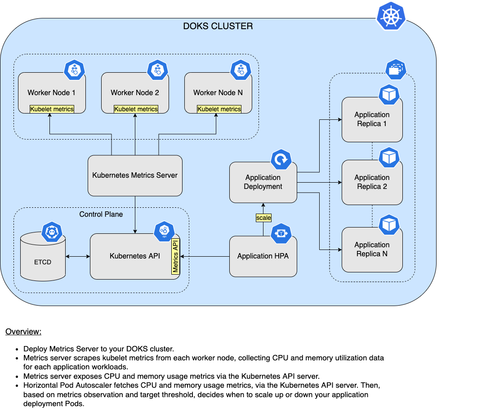

# Description

[Metrics server](https://github.com/kubernetes-sigs/metrics-server) is an open source metrics API implementation, created and maintained by the `Kubernetes SIG`. Main purpose of metrics-server is to help the Kubernetes [Horizontal Pod Autoscaler](https://kubernetes.io/docs/tasks/run-application/horizontal-pod-autoscale) to automatically scale up or down your application workloads based on external factors (such as heavy HTTP traffic). In a nutshell, metrics-server works by collecting resource metrics from `Kubelets` and exposing them via the `Kubernetes API Server` to be consumed by the Horizontal Pod Autoscaler (aka `HPA`). Metrics API can also be accessed by `kubectl top`, making it easier to debug autoscaling pipelines.

Although you can query metrics-server for resource utilization metrics such as CPU and memory, it's not advised to do so. This is due to the fact that provided metrics data may not be very accurate. For better results you would want to use a dedicated monitoring solution like [Prometheus](https://prometheus.io).

Please make sure to check metrics-server [official documentation](https://github.com/kubernetes-sigs/metrics-server/blob/master/README.md) for more details.

**Note:**

DigitalOcean is using Helm v3 to deploy metrics-server to your DOKS cluster.

## Metrics-Server and HPA Overview Diagram

Below diagram shows a high level overview of how HPA (Horizontal Pod Autoscaling) works in conjunction with metrics-server:



## Software Included

| Package | Metrics-Server Version | Helm Chart Version | License |
|---------|----------------------|--------------------|---------|
| Metrics-Server | [0.6.1](https://github.com/kubernetes-sigs/metrics-server/releases/tag/v0.6.1) | [3.8.2](https://github.com/kubernetes-sigs/metrics-server/releases/tag/metrics-server-helm-chart-3.8.2) | [Apache 2.0](https://github.com/kubernetes-sigs/metrics-server/blob/master/LICENSE) |

## Getting Started

### Connecting to Your Cluster

You can connect to your DigitalOcean Kubernetes cluster by following our [how-to guide](https://www.digitalocean.com/docs/kubernetes/how-to/connect-to-cluster/).

For additional instructions on configuring a [DigitalOcean Kubernetes](https://cloud.digitalocean.com/kubernetes/clusters/) cluster, see the following guides:

- [How to Set Up a DigitalOcean Managed Kubernetes Cluster (DOKS)](https://github.com/digitalocean/Kubernetes-Starter-Kit-Developers/tree/main/01-setup-DOKS#how-to-set-up-a-digitalocean-managed-kubernetes-cluster-doks)
- [How to Set up DigitalOcean Container Registry](https://github.com/digitalocean/Kubernetes-Starter-Kit-Developers/tree/main/02-setup-DOCR#how-to-set-up-digitalocean-container-registry)

### Verifying that Metrics-Server is Running

First, verify that the metrics-server Helm installation was successful by running following command:

```console
helm ls -n metrics-server
```

If the installation was successful, the `STATUS` column value in the output reads `deployed`:

```text
NAME            NAMESPACE       REVISION        UPDATED                                 STATUS          CHART                   APP VERSION
metrics-server  metrics-server  1               2022-03-16 15:10:59.586786 +0200 EET    deployed        metrics-server-3.8.2    0.6.1 
```

Next, verify that the metrics-server pods are up and running with the following command:

```console
kubectl get pods -n metrics-server
```

If they're running, all pods listed in the output are in a `READY` state and the `STATUS` for each reads `Running`:

```text
NAME                              READY   STATUS    RESTARTS   AGE
metrics-server-694d47d564-mzq2c   1/1     Running   0          75s
metrics-server-694d47d564-pl7v7   1/1     Running   0          75s
```

### Tweaking Helm Chart Values

The `metrics-server` has custom default Helm values. See the [values](./values.yml) file from the main GitHub repository (explanations are provided inside, where necessary).

To inspect its current values, run the following command:

```console
helm show values metrics-server/metrics-server --version 3.8.2
```

To change these values, open the Helm values file `values.yml`, change whatever values you want, save and exit the file, and apply the changes by running `helm upgrade` command:

```console
helm upgrade metrics-server metrics-server/metrics-server --version 3.8.2 \
  --namespace metrics-server \
  --values values.yml
```

### Checking Available Metrics

The quickest way to test metrics data is via the `kubectl top` subcommand. You can check resource usage at cluster level (worker nodes), or at pods level.

To check resource usage at cluster level (worker nodes), please run below command:

```console
kubectl top nodes
```

The output looks similar to (notice the `resource usage` being displayed for both `CPU` and `memory` on each `worker node`):

```text
NAME                   CPU(cores)   CPU%   MEMORY(bytes)   MEMORY%   
basicnp-uidj6          50m          5%     1183Mi          75%       
basicnp-uidjt          75m          8%     1180Mi          75%       
pool-ocas657r9-u0h5m   1619m        85%    2358Mi          75%       
pool-ocas657r9-u0h5q   147m         7%     2322Mi          74%
```

You can also check resource usage at Pod level for a specific namespace, like this:

```console
kubectl top pods -n metrics-server
```

The output looks similar to (notice `CPU usage` expressed in `millicores`, as well as `memory usage` in `Mebibytes`):

```text
NAME                              CPU(cores)   MEMORY(bytes)   
metrics-server-694d47d564-mzq2c   4m           24Mi            
metrics-server-694d47d564-pl7v7   4m           25Mi
```

### Upgrading Metrics-Server Stack

You can check what versions are available to upgrade by navigating to the [metrics-server](https://github.com/kubernetes-sigs/metrics-server/releases) official releases page from GitHub. Alternatively, you can use [ArtifactHUB](https://artifacthub.io/packages/helm/metrics-server/metrics-server).

To upgrade the stack to a newer version, run the following command, replacing the `< >` placeholders with their corresponding information:

```console
helm upgrade metrics-server metrics-server/metrics-server \
  --version <METRICS_SERVER_NEW_VERSION> \
  --namespace metrics-server \
  --values <YOUR_HELM_VALUES_FILE>
```

See [helm upgrade](https://helm.sh/docs/helm/helm_upgrade/) for command documentation.

Also, make sure to check the [compatibility matrix](https://github.com/kubernetes-sigs/metrics-server#compatibility-matrix), which shows what metrics-server API version is supported by what Kubernetes version.

### Uninstalling Metrics-Server Stack

To delete your installation of `metrics-server`, run the following `Helm` command:

```console
helm uninstall metrics-server -n metrics-server
```

**Note:**

The above command will delete all the associated `Kubernetes` resources installed by the `metrics-server` Helm chart, except the namespace itself. To delete the `metrics-server namespace` as well, run following command:

```console
kubectl delete ns metrics-server
```

### Additional Resources

- [Kubernetes Horizontal Pod Autoscaling](https://kubernetes.io/docs/tasks/run-application/horizontal-pod-autoscale)
- [Kubernetes Resource Metrics Pipeline](https://kubernetes.io/docs/tasks/debug-application-cluster/resource-metrics-pipeline)
- [HPA Walkthrough using Metrics Server](https://kubernetes.io/docs/tasks/run-application/horizontal-pod-autoscale-walkthrough)
