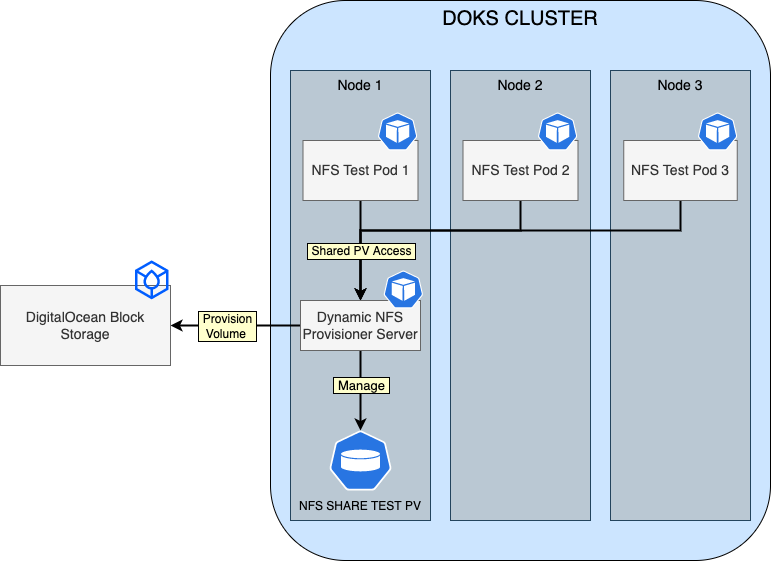

# Description

[OpenEBS Dynamic NFS PV Provisioner](https://github.com/openebs/dynamic-nfs-provisioner) helps developers easily deploy Kubernetes workloads that require fast and highly reliable shared NFS storage. It can be used to dynamically provision NFS Volumes using different kinds (local or network) of block storage available on the Kubernetes nodes. Using NFS Volumes, you can share volume data across the pods running on different node machines. You can easily create NFS Volumes using OpenEBS Dynamic NFS Provisioner and use it anywhere.

Under the hood, the NFS provisioner runs a NFS server pod for each shared storage volume. It uses DigitalOcean block storage (do-block-storage) as the backing volume for NFS.

**Note:**

- This stack requires a minimum configuration of 2 Nodes at the $10/month plan (2GB memory / 1 vCPU).
- A 1Gi block storage volume is required as well for testing the dynamic NFS provisioner.

## OpenEBS NFS Provisioner Overview Diagram

The following diagram shows how OpenEBS Dynamic NFS Provisioner works on a Kubernetes cluster (based on the example used in the getting started section):



## Software included

| Package | License |
| --------| ------- |
| OpenEBS NFS provisioner | [Apache 2.0](https://github.com/openebs/openebs/blob/main/LICENSE) |

### Connecting to Your Cluster

You can connect to your DigitalOcean Kubernetes cluster by following our [how-to guide](https://www.digitalocean.com/docs/kubernetes/how-to/connect-to-cluster).

For additional instructions on configuring a [DigitalOcean Kubernetes](https://cloud.digitalocean.com/kubernetes/clusters) cluster, see the following [guide](https://github.com/digitalocean/Kubernetes-Starter-Kit-Developers/tree/main/01-setup-DOKS#how-to-set-up-a-digitalocean-managed-kubernetes-cluster-doks).

### Confirming that OpenEBS NFS Provisioner is Running

First, verify that the Helm installation was successful by running following command:

```bash
helm ls -n openebs-nfs-provisioner
```

If the installation was successful, the `STATUS` column value in the output reads `deployed`:

```text
NAME                    NAMESPACE               REVISION        UPDATED                                 STATUS          CHART                   APP VERSION
openebs-nfs-provisioner openebs-nfs-provisioner 1               2022-05-17 10:08:02.345252 +0300 EEST   deployed        nfs-provisioner-0.9.0   0.9.0
```

Next, verify that the `openebs-nfs-provisioner` pod is up and running with the following command:

```console
kubectl get pods --all-namespaces -l name=openebs-nfs-provisioner
```

If it's running, the pod listed in the output are in a `READY` state and the `STATUS` reads `Running`:

```text
NAMESPACE                 NAME                                       READY   STATUS    RESTARTS   AGE
openebs-nfs-provisioner   openebs-nfs-provisioner-5cfd76f4fc-5k7wf   1/1     Running   0          11m
```

Finally, verify if the read-write storage class `nfs-rwx-storage` is created.

```console
kubectl get storageclass nfs-rwx-storage
```

This should result in an output as below:

```text
NAME              PROVISIONER         RECLAIMPOLICY   VOLUMEBINDINGMODE   ALLOWVOLUMEEXPANSION   AGE
nfs-rwx-storage   openebs.io/nfsrwx   Delete          Immediate           false                  5d15h
```

Note that you can create your own storage class, and as many as you like. As a reference, here is the [manifest for the nfs-rwx-storage class](assets/manifests/sc-nfs-rwx.yaml).

### Testing RWX Access Mode for OpenEBS NFS Volumes

First, you will create a new PVC referencing the OpenEBS `nfs-rwx-storage` class:

```yaml
apiVersion: v1
kind: PersistentVolumeClaim
metadata:
  name: nfs-pvc
spec:
  storageClassName: nfs-rwx-storage
  accessModes:
    - ReadWriteMany
  resources:
    requests:
      storage: 1Gi
```

Above manifest instructs Kubernetes to create a new PVC based on the `nfs-rwx-storage` class via `spec.storageClassName`, and sets access mode to `ReadWriteMany` (`spec.accessModes`). You can accomplish the above task by using the [sample manifest](assets/manifests/nfs-pvc.yaml) provided in the marketplace GitHub repository:

```shell
kubectl apply -f https://raw.githubusercontent.com/digitalocean/marketplace-kubernetes/master/stacks/openebs-nfs-provisioner/assets/manifests/nfs-pvc.yaml
```

Now, check if the `nfs-pvc` is healthy:

```shell
kubectl get pvc nfs-pvc
```

The output looks similar to:

```text
NAME      STATUS   VOLUME                                     CAPACITY   ACCESS MODES   STORAGECLASS     AGE
nfs-pvc   Bound    pvc-776fd89f-c7aa-4e57-a8f5-914ab77f71d5   1Gi        RWX            nfs-rwx-storage  1m
```

The NFS PVC should be in a `Bound` state, and access mode set to `RWX` (ReadWriteMany). Storage class should display `nfs-rwx-storage`, and a capacity of `1Gi` should be provisioned.

Next, create the [nfs-share-test](assets/manifests/nfs-share-test.yaml) deployment provided in the marketplace GitHub repository:

```shell
kubectl apply -f https://raw.githubusercontent.com/digitalocean/marketplace-kubernetes/master/stacks/openebs-nfs-provisioner/assets/manifests/nfs-share-test.yaml
```

Above manifest will create the `nfs-share-test` deployment with a replica count of 3, and mounts same volume (`nfs-share-test`) for all pods to consume. Then, the Kubernetes [Downward API](https://kubernetes.io/docs/tasks/inject-data-application/downward-api-volume-expose-pod-information) is used to read each Pod metadata (such as Node name, Pod Name/IP), and write the details in a single log file from the NFS share (`/mnt/nfs-test/nfs-rwx.log`).

Now, inspect `nfs-share-test` deployment Pods status:

```shell
kubectl get pods -l test=nfs-share
```

The output looks similar to:

```text
NAME                              READY   STATUS    RESTARTS   AGE
nfs-share-test-67bf984f88-4flq2   1/1     Running   0          98s
nfs-share-test-67bf984f88-9hmfz   1/1     Running   0          98s
nfs-share-test-67bf984f88-tnz8q   1/1     Running   0          98s
```

All pods should be healthy and in a running state.

Finally, check `nfs-share-test` deployment logs:

```shell
kubectl exec -it deployments/nfs-share-test -- tail -f /mnt/nfs-test/nfs-rwx.log
```

The output looks similar to:

```text
...
[2022-05-31 11:09:04][NFS-RWX-TEST] NODE=basicnp-cajb7 POD=nfs-share-test-67bf984f88-9hmfz POD_IP=10.244.0.229
[2022-05-31 11:09:04][NFS-RWX-TEST] NODE=basicnp-cajbm POD=nfs-share-test-67bf984f88-4flq2 POD_IP=10.244.0.112
[2022-05-31 11:09:14][NFS-RWX-TEST] NODE=basicnp-cajb7 POD=nfs-share-test-67bf984f88-tnz8q POD_IP=10.244.0.243
[2022-05-31 11:09:14][NFS-RWX-TEST] NODE=basicnp-cajb7 POD=nfs-share-test-67bf984f88-9hmfz POD_IP=10.244.0.229
[2022-05-31 11:09:14][NFS-RWX-TEST] NODE=basicnp-cajbm POD=nfs-share-test-67bf984f88-4flq2 POD_IP=10.244.0.112
[2022-05-31 11:09:24][NFS-RWX-TEST] NODE=basicnp-cajb7 POD=nfs-share-test-67bf984f88-tnz8q POD_IP=10.244.0.243
...
```

Each pod should be able to write to the same log file (`nfs-rwx.log`), and publish its metadata each 10 seconds. This confirms that NFS storage is working.

To delete the test application, use the following. However, keep the applications running if you want to further explore the failure cases in the section below.

```shell
kubectl delete -f https://raw.githubusercontent.com/digitalocean/marketplace-kubernetes/master/stacks/openebs-nfs-provisioner/assets/manifests/nfs-share-test.yaml
kubectl delete -f https://raw.githubusercontent.com/digitalocean/marketplace-kubernetes/master/stacks/openebs-nfs-provisioner/assets/manifests/nfs-pvc.yaml
```

### Failure Cases for NFS Provisioner

Note the nfs-pvc-* pod name in openebs-nfs-provisioner namespace. This pod is running the NFS server, which is sharing the nfs-pvc volume.

```text
~ kubectl get pods -n openebs-nfs-provisioner -o wide
NAME                                                            READY   STATUS    RESTARTS     AGE    IP             NODE                   NOMINATED NODE   READINESS GATES
nfs-pvc-509d7613-b141-4edd-b0d5-59ae9f2a0eb3-5c49b6d9f6-7rhw2   1/1     Running   0            153m   10.244.0.109   pool-vc6axdi2c-ct7j3   <none>           <none>
openebs-nfs-provisioner-5cfd76f4fc-47xls                        1/1     Running   1 (8h ago)   8h     10.244.1.157   pool-vc6axdi2c-ct7x4   <none>           <none>
```

You can see how this is a single point of failure. Two obvious failure scenarios are:

- The nfs-pvc-* pod itself is terminated unexpectedly.
- The underlying node of nfs-pvc-* pod is terminated. Note that if the underlying node is drained, then the nfs server pod will have a chance to reschedule, hence minimizing the impact.

How do we determine the NFS server outage when any of the above happen? We can use the same application from the above section, and watch the time gap in the logs because of the incident. In the normal scenario, data is read and logs are written for every pod in 10 sec interval:

```text
~ kubectl exec -it deployments/nfs-share-test -- tail -f /mnt/nfs-test/nfs-rwx.log

[2022-06-01 08:36:16][NFS-RWX-TEST] NODE=pool-vc6axdi2c-ct7x4 POD=nfs-share-test-67bf984f88-2qw6q POD_IP=10.244.1.247
[2022-06-01 08:36:19][NFS-RWX-TEST] NODE=pool-vc6axdi2c-ct7j3 POD=nfs-share-test-67bf984f88-nxbrg POD_IP=10.244.0.82
[2022-06-01 08:36:25][NFS-RWX-TEST] NODE=pool-vc6axdi2c-cezr9 POD=nfs-share-test-67bf984f88-56sxz POD_IP=10.244.1.120
[2022-06-01 08:36:26][NFS-RWX-TEST] NODE=pool-vc6axdi2c-ct7x4 POD=nfs-share-test-67bf984f88-2qw6q POD_IP=10.244.1.247
[2022-06-01 08:36:29][NFS-RWX-TEST] NODE=pool-vc6axdi2c-ct7j3 POD=nfs-share-test-67bf984f88-nxbrg POD_IP=10.244.0.82
[2022-06-01 08:36:35][NFS-RWX-TEST] NODE=pool-vc6axdi2c-cezr9 POD=nfs-share-test-67bf984f88-56sxz POD_IP=10.244.1.120
[2022-06-01 08:36:36][NFS-RWX-TEST] NODE=pool-vc6axdi2c-ct7x4 POD=nfs-share-test-67bf984f88-2qw6q POD_IP=10.244.1.247
[2022-06-01 08:36:39][NFS-RWX-TEST] NODE=pool-vc6axdi2c-ct7j3 POD=nfs-share-test-67bf984f88-nxbrg POD_IP=10.244.0.82
[2022-06-01 08:36:45][NFS-RWX-TEST] NODE=pool-vc6axdi2c-cezr9 POD=nfs-share-test-67bf984f88-56sxz POD_IP=10.244.1.120
```

Now, kill the nfs-pvc-* pod, and watch the gap in the logs. In this particular test, you can see ~90 seconds of delay for NFS server to be fully functional after getting killed:

```text
[2022-06-01 08:37:56][NFS-RWX-TEST] NODE=pool-vc6axdi2c-ct7x4 POD=nfs-share-test-67bf984f88-2qw6q POD_IP=10.244.1.247
[2022-06-01 08:37:59][NFS-RWX-TEST] NODE=pool-vc6axdi2c-ct7j3 POD=nfs-share-test-67bf984f88-nxbrg POD_IP=10.244.0.82
[2022-06-01 08:38:05][NFS-RWX-TEST] NODE=pool-vc6axdi2c-cezr9 POD=nfs-share-test-67bf984f88-56sxz POD_IP=10.244.1.120
[2022-06-01 08:38:06][NFS-RWX-TEST] NODE=pool-vc6axdi2c-ct7x4 POD=nfs-share-test-67bf984f88-2qw6q POD_IP=10.244.1.247
[2022-06-01 08:38:09][NFS-RWX-TEST] NODE=pool-vc6axdi2c-ct7j3 POD=nfs-share-test-67bf984f88-nxbrg POD_IP=10.244.0.82
[2022-06-01 08:38:15][NFS-RWX-TEST] NODE=pool-vc6axdi2c-cezr9 POD=nfs-share-test-67bf984f88-56sxz POD_IP=10.244.1.120
[2022-06-01 08:38:25][NFS-RWX-TEST] NODE=pool-vc6axdi2c-cezr9 POD=nfs-share-test-67bf984f88-56sxz POD_IP=10.244.1.120
[2022-06-01 08:40:11][NFS-RWX-TEST] NODE=pool-vc6axdi2c-ct7j3 POD=nfs-share-test-67bf984f88-nxbrg POD_IP=10.244.0.82
[2022-06-01 08:40:14][NFS-RWX-TEST] NODE=pool-vc6axdi2c-cezr9 POD=nfs-share-test-67bf984f88-56sxz POD_IP=10.244.1.120
```

Now, kill the underlying node (go to droplet page in your cloud console and kill the droplet directly). Around 4-7 minutes of downtime is expected in this failure scenario. In one particular test, the NFS server has to be restarted as well, as it kept waiting for the volume to be available. 

```text
[2022-06-01 08:47:04][NFS-RWX-TEST] NODE=pool-vc6axdi2c-cezr9 POD=nfs-share-test-67bf984f88-56sxz POD_IP=10
[2022-06-01 08:47:14][NFS-RWX-TEST] NODE=pool-vc6axdi2c-cezr9 POD=nfs-share-test-67bf984f88-56sxz POD_IP=10
[2022-06-01 08:47:23][NFS-RWX-TEST] NODE=pool-vc6axdi2c-ct7x4 POD=nfs-share-test-67bf984f88-2qw6q POD_IP=10
[2022-06-01 08:54:56][NFS-RWX-TEST] NODE=pool-vc6axdi2c-ct7x4 POD=nfs-share-test-67bf984f88-jlstx POD_IP=10
[2022-06-01 08:56:47][NFS-RWX-TEST] NODE=pool-vc6axdi2c-cezr9 POD=nfs-share-test-67bf984f88-56sxz POD_IP=10
[2022-06-01 08:56:47][NFS-RWX-TEST] NODE=pool-vc6axdi2c-ct7x4 POD=nfs-share-test-67bf984f88-2qw6q POD_IP=10
[2022-06-01 08:56:48][NFS-RWX-TEST] NODE=pool-vc6axdi2c-ct7x4 POD=nfs-share-test-67bf984f88-jlstx POD_IP=10
[2022-06-01 08:56:57][NFS-RWX-TEST] NODE=pool-vc6axdi2c-cezr9 POD=nfs-share-test-67bf984f88-56sxz POD_IP=10
```

**It is very important to be aware of the the service impact due to these unexpected events, and design your application accordingly.**

### Benchmarking OpenEBS NFS Performance

Benchmarking is subjective (iops, throughput, and latency for different configurations) and dependent on your specific needs. For example, if you are storing 2MB+ size files on your NFS server, then benchmarking for 4K sized blocks is not appropriate. Saying this, a good starter benchmark would be to do a basic measurement and be aware of the limits. A well-known tool is [fio](https://github.com/axboe/fio). [Kubestr](https://github.com/kastenhq/kubestr) provides a CLI-based wrapper for using fio on Kubernetes. Download kubestr to your laptop, and you can benchmark any storage class with just one command with the default fio configuration:

```text
~ kubestr fio -s rwx-storage -z 50Gi 
PVC created kubestr-fio-pvc-87mg8
Pod created kubestr-fio-pod-wjtnn
Running FIO test (default-fio) on StorageClass (rwx-storage) with a PVC of Size (50Gi)
Elapsed time- 2m1.099989659s
FIO test results:

FIO version - fio-3.20
Global options - ioengine=libaio verify=0 direct=1 gtod_reduce=1

JobName: read_iops
  blocksize=4K filesize=2G iodepth=64 rw=randread
read:
  IOPS=1086.609985 BW(KiB/s)=4363
  iops: min=554 max=1934 avg=1090.666626
  bw(KiB/s): min=2216 max=7736 avg=4362.666504

JobName: write_iops
  blocksize=4K filesize=2G iodepth=64 rw=randwrite
write:
  IOPS=1085.600220 BW(KiB/s)=4359
  iops: min=554 max=1938 avg=1088.033325
  bw(KiB/s): min=2216 max=7752 avg=4352.133301

JobName: read_bw
  blocksize=128K filesize=2G iodepth=64 rw=randread
read:
  IOPS=1086.641846 BW(KiB/s)=139625
  iops: min=554 max=1940 avg=1090.833374
  bw(KiB/s): min=70912 max=248320 avg=139626.671875

JobName: write_bw
  blocksize=128k filesize=2G iodepth=64 rw=randwrite
write:
  IOPS=1087.179199 BW(KiB/s)=139695
  iops: min=552 max=1936 avg=1089.833374
  bw(KiB/s): min=70656 max=247808 avg=139501.406250

Disk stats (read/write):
  -  OK
~
```

### Tweaking Helm Values

The OpenEBS NFS provisioner stack provides some custom values to start with. Please have a look at the [values](values.yml) file from the main GitHub repository.

You can always inspect all the available options, as well as the default values for the OpenEBS NFS provisioner Helm chart by running below command:

```console
helm show values openebs-nfs/nfs-provisioner --version 0.9.0 --version 0.9.0
```

After tweaking the Helm values file (`values.yml`) according to your needs, you can always apply the changes via `helm upgrade` command, as shown below:

```console
helm upgrade openebs-nfs-provisioner openebs-nfs/nfs-provisioner --version 0.9.0 \
  --namespace openebs-nfs-provisioner \
  --values values.yml
```

### Upgrading the OpenEBS Dynamic NFS Provisioner Chart

You can check what versions are available to upgrade by navigating to the [openebs/openebs](https://github.com/openebs/openebs) official releases page from GitHub.

To upgrade the stack to a newer version, run the following command, replacing the `<>` placeholders with their corresponding information:

```console
helm upgrade openebs-nfs-provisioner openebs-nfs/nfs-provisioner \
  --version <OPENEBS__NFS_PROVISIONER_STACK_NEW_VERSION> \
  --namespace openebs-nfs-provisioner \
  --values <YOUR_HELM_VALUES_FILE>
```

See [helm upgrade](https://helm.sh/docs/helm/helm_upgrade) for command documentation.

## Uninstalling OpenEBS NFS Provisioner Stack

To delete your installation of `openebs-nfs-provisioner,`, run the following command:

```console
helm uninstall openebs-nfs-provisioner -n openebs-nfs-provisioner
```

**Note:**

- The Helm uninstall command will delete all the associated Kubernetes resources installed by the `openebs-nfs-provisioner` Helm chart, except the namespace itself. To delete the `openebs-nfs-provisioner namespace` as well, run the following command:

    ```console
    kubectl delete ns openebs-nfs-provisioner
    ```

- You have to manually delete the DO block storage volume created by the NFS PVC used for testing, if no longer needed. You can do this either via the DigitalOcean [volumes web panel](https://cloud.digitalocean.com/volumes), or `doctl`:

    ```console
    $ doctl compute volume list --format ID,Name,Size

    ID                                      Name                                        Size
    c1c46cab-e30b-11ec-932d-0a58ac14c29b    pvc-150c7961-18ec-497f-8a3e-bb5e0d29299c    5 GiB
    f3c4cc73-e30b-11ec-99e3-0a58ac14c1da    pvc-dec8c104-4542-4657-a5ae-661a5476dee2    1 GiB
    ```

    Then, delete the corresponding volume by ID. Please bear in mind that your ID might differ in the volume listing, so make sure to pick the right one and replace the `<>` placeholders accordingly:

    ```console
    doctl compute volume delete <YOUR_NFS_VOLUME_ID>
    ```

### Additional Resources

- [OpenEBS NFS Provisioner on GitHub](https://github.com/openebs/openebs)
- [Installation guide](https://openebs.io/docs/quickstart-guide/installation)
- [Deploying Wordpress on DigitalOcean using OpenEBS NFS Provisioner](https://github.com/digitalocean/container-blueprints/tree/main/DOKS-wordpress)
- [Configuring Node Affinity for NFS Volumes](https://github.com/openebs/dynamic-nfs-provisioner/blob/develop/docs/tutorial/node-affinity.md)
- [Setting Resource requirements for NFS Server](https://github.com/openebs/dynamic-nfs-provisioner/blob/develop/docs/tutorial/configure-nfs-server-resource-requirements.md)
- [Exposing NFS Volume outside the cluster](https://github.com/openebs/dynamic-nfs-provisioner/blob/develop/docs/expose-nfs-server.md)
- [Monitoring NFS Provisioner](https://github.com/openebs/dynamic-nfs-provisioner/blob/develop/docs/metrics.md)
- [Configuring Hook for NFS Provisioner](https://github.com/openebs/dynamic-nfs-provisioner/blob/develop/docs/tutorial/nfs-hook.md)
