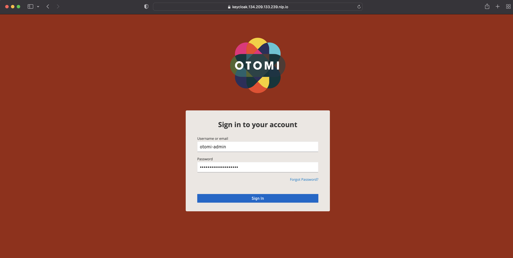
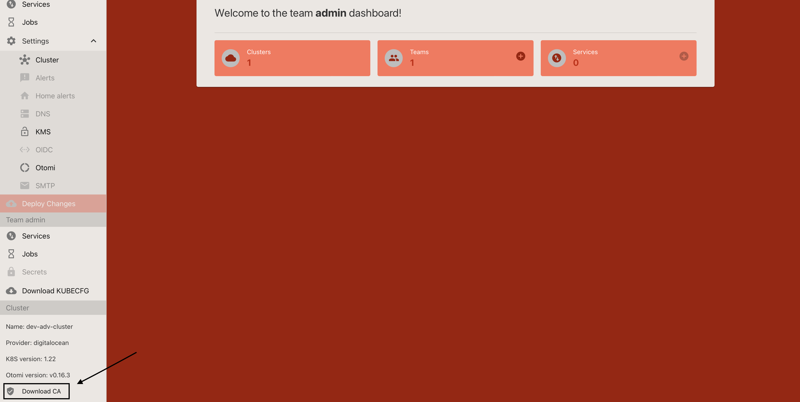
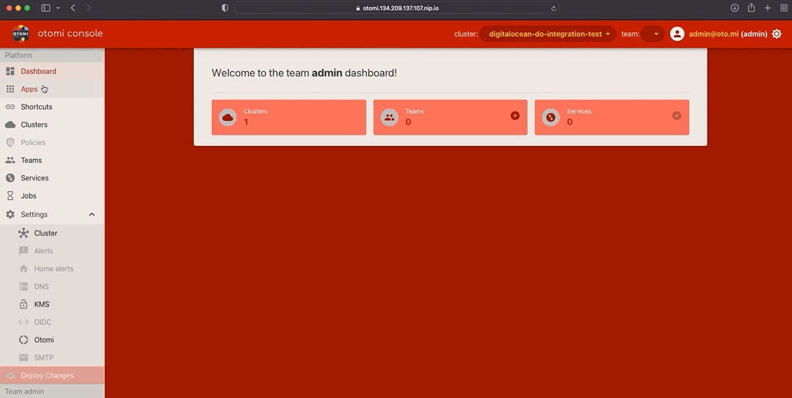
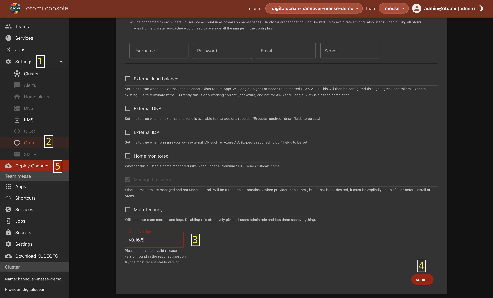

<h1 align="center">
  <br/>
  Self-hosted PaaS for Kubernetes
</h1>
<p align="center"><b>Deploy your apps fast and safe on any Kubernetes cluster in any cloud</b></p>

## Description

[Otomi](https://github.com/redkubes/otomi-core) brings a full PaaS experience to Kubernetes without any constraints or abstractions on top of the tools you already love and use. No more reinventing the wheel when building and maintaining your own Kubernetes based (developer) platform.

It consists of a complete suite of pre-configured, integrated and automated applications for Kubernetes (like Istio, Knative, Harbor, Prometheus, Argo CD), combined with developer self-service, and offered as a single installable package.

**Core features**

- Drag and Drop popular open-source apps to create your preferred suite
- An advanced ingress architecture. Expose services with just a few clicks
- Configure network policies for internal ingress and external egress
- Create Kubernetes Jobs and Cron Jobs without writing any YAML
- Onboard (development) teams or projects within minutes in a comprehensive multi-tenant setup
- Make developers self-serving by providing access to predefined automation tasks

**Optional (if app is activated)**

- Deploy serverless workloads without writing any YAML
- Create and manage secrets in HashiCorp Vault and use them in your workloads
- GitOps with Argo CD out-of-the-box
- Policy enforcement is based on a default set of security policies
- Full observability based on Prometheus, Grafana, Loki and Alert manager
- Store images in Harbor
<!-- 7. Runtime container vulnerability scanning -->

**Notes:**

- This stack requires a minimum configuration of 4 nodes at the $0.13/hour plan (2.5GB memory/2 vCPUs)
- If you have access to `professional plans`, then we recommend using a configuration of 3 nodes at the $0.19/hour plan (6 GB/ 4vCPUs)
- Otomi is installed with an auto-generated CA and uses the public IP of the load balancer with nip.io for all hostnames. See the Otomi [documentation](https://otomi.io/docs/installation/optional) for advanced configurations using DNS, value encryption, Let's Encrypt and Azure Active Directory as IdP.

## Software included

| Package               | Application Version   |License                                                                                    |
| ---| ---- | ------------- |
| otomi | [v0.16.x](https://github.com/redkubes/otomi-core/releases/) | [Apache 2.0](https://github.com/redkubes/otomi-core/blob/main/LICENSE) |

## Getting Started

### How to Connect to Your Cluster

Follow these [instructions](https://www.digitalocean.com/docs/kubernetes/how-to/connect-to-cluster/) to connect to your cluster with `kubectl` and `doctl`.

### Confirming that Otomi is Running

First, check if the Otomi installation was successful by running the command below:

```bash
kubectl get job otomi -w
```

The output looks similar to the following:

```text
NAME    COMPLETIONS   DURATION   AGE
otomi   1/1           14m        14m
```
  
Next, check the installer job logs to get the otomi console `url` and `credentials` by running the following command:

```bash
kubectl logs jobs/otomi -n default --tail=7
```

The output looks similar to the following:

```bash
########################################################################################################################################
#
#  To start using Otomi, go to https://otomi.134.209.133.239.nip.io and sign in to the web console
#  with username "otomi-admin" and password "OTzVCbJbvIN1T0LIij4U".
#  Then activate Drone. For more information see: https://otomi.io/docs/installation/activation/
#
########################################################################################################################################
```
  
### Accessing Otomi console

- Sign in to the Otomi web console `url` using the `credentials` found in the installer job logs.

<!-- <p align="center"></p> -->

  

- Add the auto-generated CA to your keychain/credential manager (optional)



```bash
NOTE:
# To prevent you from clicking away lots of security warnings in your browser, you can add the generated CA to your keychain/credential manager:
# Since we install Otomi without proving a custom CA or using LetsEncrypt, the installer generated a CA which is not trusted on your local machine.
```

- In the left menu of Otomi Console, click on "Download CA"
- Double click the downloaded `ca.crt` or add the CA to your keychain on your mac using the following command:
  
  ```bash
  # On Mac
  sudo security add-trusted-cert -d -r trustRoot -k /Library/Keychains/System.keychain ~/Downloads/ca.crt
  # Restart the browser or open it in private mode
  ```  

  ```powershell
  # On Windows(PowerShell - Run as Administrator)
  # Use certutil:
  certutil.exe -addstore root <downloaded cert path>
  # Or 
  Import-Certificate -FilePath "<downloaded cert path>" -CertStoreLocation Cert:\LocalMachine\Root
  # Restart the browser or open it in private mode
  ```

### Post-install configurations

- In the side menu of Otomi Console under `Platform`, select `Apps` and click on the **Drone** app
- Click on the `play` button in the top right. A new tab will open for Drone and click `CONTINUE`
- Sign in locally with as `otomi-admin` and the `password` provided in the logs of the installer job.
- Click on `Authorize Application`
- Click on `SUBMIT` on the Complete your Drone Registration page. You don't need to fill in your Email, Full Name or Company Name if you don't want to
- Click on the `otomi/values` repository
- Click on `+ ACTIVATE REPOSITORY`



Now head to the [workshops](https://github.com/redkubes/workshops) to explore Otomi through a series of hands-on labs. 

## Upgrade Instructions

Upgrading to a new version of Otomi can be easily done via the `otomi-console` as shown in the picture below




```bash
NOTE:
# The upgrade must be incremental, e.g.: 0.16.4 -> 0.16.5 -> 0.16.6
```

### Additional Resources

- [Otomi Documentation](https://otomi.io/docs/installation/)cc
- [Otomi Slack](https://otomi.slack.com/ssb/redirect#/shared-invite/email)

