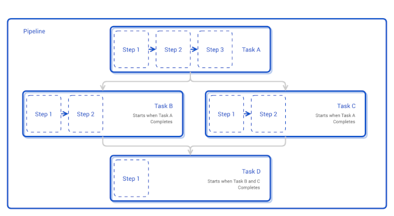

# Description

[Tekton](https://tekton.dev) is a cloud native solution for building CI/CD systems. It is specifically engineered to run on Kubernetes, and empowers developers to create CI pipelines using reusable blocks. Tekton provides also a [CLI](https://tekton.dev/docs/cli) tool, and a [catalog](https://hub.tekton.dev) of community-contributed building blocks (Tasks, Pipelines, etc.) which make Tekton a complete ecosystem.

Tekton includes the following:

- [Pipelines](https://tekton.dev/docs/pipelines): Basic building blocks (tasks and pipelines) of a CI/CD workflow.
- [Triggers](https://tekton.dev/docs/triggers): Event triggers for a CI/CD workflow.
- [CLI](https://tekton.dev/docs/cli): Command-line interface for CI/CD workflow management.
- [Dashboard](https://tekton.dev/docs/dashboard): General-purpose, web-based UI for Pipelines.

Continuous integration (or CI) is the process of automating the integration of small code changes from multiple contributors into a single software project. To achieve CI a central repository is used (e.g. Git), where each developer (or contributor) pushes code changes. Then, a CI tool (e.g. Tekton) detects changes and starts the CI automation.

In general, each CI automation consists of several steps:

1. Fetching application code from a remote SCM (Source Control Management) repository, such as Git.
2. Building the application (specific compilers are invoked, depending on the programming language).
3. Testing application code changes (via unit tests, usually).
4. Creating the final artifact (a binary or a zip file, a Docker file, etc) for application delivery.
5. Pushing the application artifact to a remote repository for later use by a CD (Continuous Deployment/Delivery) system.

In case of Tekton, CI automation is implemented using [Pipelines](https://tekton.dev/docs/pipelines/pipelines). Each pipeline is comprised of [tasks]((https://tekton.dev/docs/pipelines/tasks)) and accompanying [steps](https://tekton.dev/docs/pipelines/tasks/#defining-steps)) used to fetch, build, test, and publish the final artifact to a remote repository (e.g a Docker registry).

A step is the basic unit of execution for a pipeline, and can accomplish the following: compile a program, run some unit tests, deploy an image to a Docker registry, etc. Tekton performs each step within a container image you provide.

On top of that, each task and pipeline may have its own inputs and outputs, known as input and output resources in Tekton. A compilation task, for example, may have a git repository as input and a container image as output: the task clones the source code from the repository, runs some tests, and at last builds the source code into an executable container image. Below picture depicts this concept:


Following diagram illustrates the main concepts of Tekton:



Please follow the official documentation to read and learn more about [Tekton concepts](https://tekton.dev/docs/concepts).

**Notes:**

- DigitalOcean uses Helm v3 to deploy Tekton pipelines to your DOKS cluster.

## Requirements

- A Kubernetes cluster version 1.15 or higher for Tekton Pipelines v0.11.0 or higher, or a Kubernetes cluster version 1.11 or higher for Tekton releases before v0.11.0.
- To run a CI/CD workflow, you need to provide Tekton a Persistent Volume for storage purposes. The PV is required if you want to share artifacts or other pipelines resources between your tasks. A volume of `5Gi` with the default storage class is sufficient as a starting point. Please visit Tekton [Persistent Volumes](https://tekton.dev/docs/getting-started/#persistent-volumes) section from the official documentation for more information.

## Software Included

| Package | Tekton CI/CD Version | Helm Chart Version | License |
|---------|----------------------| ------------------ |-------- |
| Tekton Pipelines | [0.29.0](https://github.com/tektoncd/pipeline/releases/tag/v0.29.0) | [0.29.0](https://github.com/cdfoundation/tekton-helm-chart) | [Apache 2.0](https://opensource.org/licenses/Apache-2.0) |

## Getting Started

### How to Connect to Your Cluster

Follow these [instructions](https://www.digitalocean.com/docs/kubernetes/how-to/connect-to-cluster/) to connect to your cluster with `kubectl` and `doctl`.

### Confirming that Tekton is Running

First, check if the Helm installation was successful by running the command below:

```console
helm ls -n tekton-pipelines
```

The output looks similar to the following:

```text
NAME             NAMESPACE          REVISION    UPDATED                                 STATUS     CHART                   APP VERSION
tekton-pipeline  tekton-pipelines   1           2022-04-04 14:20:19.846426 +0300 EEST   deployed   tekton-pipeline-0.29.0  0.29.0
```

The `STATUS` column value should be `deployed`.

Next, verify if Tekton pods are up and running:

```console
kubectl get pods -n tekton-pipelines
```

The output looks similar to the following:

```text
NAME                                           READY   STATUS    RESTARTS   AGE
tekton-pipelines-controller-86f664f764-kp844   1/1     Running   0          2m
tekton-pipelines-webhook-5f9c956579-v925m      1/1     Running   0          2m
```

All pods should be in a `READY` state with a `STATUS` of `Running`.

### Tweaking Helm Chart Values

The `tekton-pipelines` stack provides some custom values to start with. See the [values](./values.yml) file from the main GitHub repository for more information.

You can inspect all the available options, as well as the default values for the `tekton-pipelines` Helm chart by running the following command:

```console
helm show values cdf/tekton-pipeline --version 0.29.0
```

After customizing the Helm values file (`values.yml`), you can apply the changes via the `helm upgrade` command, as shown below:

```console
helm upgrade tekton-pipeline cdf/tekton-pipeline --version 0.29.0 \
  --namespace tekton-pipelines \
  --values values.yml
```

### Configuring Authentication for Remote Repositories

If you are working with private Git and Docker repositories (as well as other actions that require authentication), please consult the following links:

- [Tekton Git Authentication](https://github.com/cdfoundation/tekton-helm-chart/blob/master/charts/tekton-pipeline/README.md#authenticated-git-requests)
- [Tekton Docker Registries Authentication](https://github.com/cdfoundation/tekton-helm-chart/blob/master/charts/tekton-pipeline/README.md#authenticated-docker-registries)

### Creating Your First CI Pipeline Using Tekton

With Tekton, each operation in your CI/CD workflow becomes a Step, which is executed with a container image you specify. Steps are then organized in Tasks, which run as a Kubernetes pod in your cluster. You can further organize Tasks into Pipelines, which can control the order of execution of several Tasks.

The following YAML file specifies a `Task` with one simple `Step`, which prints a `Hello World!` message using the official `Ubuntu` image:

```yaml
apiVersion: tekton.dev/v1beta1
kind: Task
metadata:
  name: hello
spec:
  steps:
    - name: hello
      image: ubuntu
      command:
        - echo
      args:
        - "Hello World!"
```

Write the YAML above to a file named `task-hello.yaml`, and apply it to your DOKS cluster:

```console
kubectl apply -f task-hello.yaml
```

Verify if the Tekton task was created, via the tkn CLI:

```console
tkn task list
```

The output looks similar to:

```text
NAME    DESCRIPTION   AGE
hello                 9 seconds ago
```

To run this task with Tekton, you need to create a `TaskRun` resource:

```yaml
apiVersion: tekton.dev/v1beta1
kind: TaskRun
metadata:
  generateName: hello-run-
spec:
  taskRef:
    name: hello
```

Write the YAML above to a file named `task-run-hello.yaml`, and apply it to your DOKS cluster:

```console
kubectl apply -f task-run-hello.yaml
```

**Hint:**

You can also accomplish the same task via `tkn` CLI:

```console
tkn task start hello
```

The output looks similar to:

```text
TaskRun started: hello-run-l8fmh

In order to track the TaskRun progress run:
tkn taskrun logs hello-run-l8fmh -f -n default
```

Tekton will now start running your Task. To see the logs of the last TaskRun, run the following `tkn` command:

```console
tkn taskrun logs --last -f
```

It may take a few moments before your Task completes. In the end, you should see a message similar to:

```text
[hello] Hello World!
```

If the output looks like above, you configured your first CI pipeline successfully. Please visit the [Getting Started with Pipelines](https://tekton.dev/docs/getting-started/pipelines) section from the official documentation page to learn more about Tekton pipelines.

## Upgrading Tekton Pipelines Stack

You can check what versions are available to upgrade, by navigating to the [CDF tekton-pipeline](https://cdfoundation.github.io/tekton-helm-chart/index.yaml) Helm chart releases page on GitHub.

Then, to upgrade the stack to a newer version, please run the following command, replacing the `<>` placeholders:

```console
helm upgrade tekton-pipeline cdf/tekton-pipeline \
  --version <TEKTON_PIPELINES_NEW_VERSION> \
  --namespace tekton-pipelines \
  --values <YOUR_HELM_VALUES_FILE>
```

See [helm upgrade](https://helm.sh/docs/helm/helm_upgrade/) for more information about the command.

## Uninstalling Tekton Pipelines Stack

To delete your installation of `tekton-pipeline`, run the following command:

```console
helm uninstall tekton-pipeline -n tekton-pipelines
```

**Note:**

The command will delete all the associated Kubernetes resources installed by the `cdf/tekton-pipeline` Helm chart, except the namespace itself. To delete the `tekton-pipelines namespace` as well, run the following command:

```console
kubectl delete ns tekton-pipelines
```

### Additional Resources

To study more about Tekton, you can visit the following Tekton topics:

- [Tekton CLI](https://tekton.dev/docs/cli)
- [LimitRange support for Pipelines](https://tekton.dev/docs/pipelines/limitrange)
- [Pipelines/Tasks Workspaces](https://tekton.dev/docs/pipelines/workspaces)
- [Events](https://tekton.dev/docs/pipelines/events)
- [Variable Substitutions](https://tekton.dev/docs/pipelines/variables)
- [Authentication for Pipelines](https://tekton.dev/docs/pipelines/auth)
- [Pipeline Metrics](https://tekton.dev/docs/pipelines/metrics)
- [Tekton Controller HA Support](https://tekton.dev/docs/pipelines/enabling-ha)
