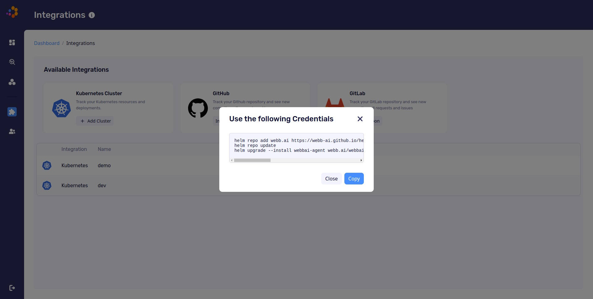
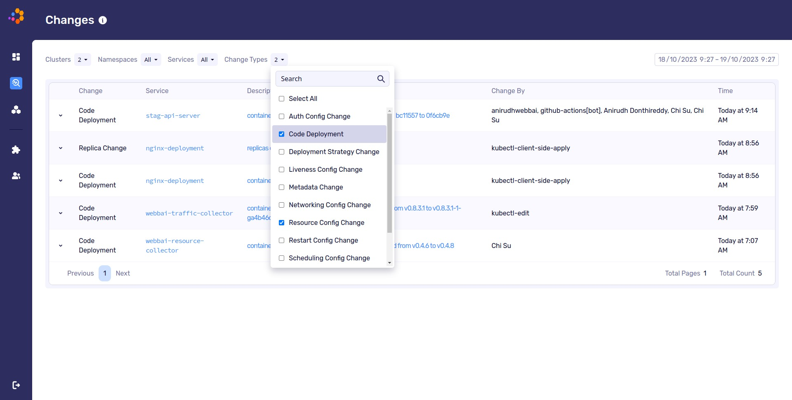
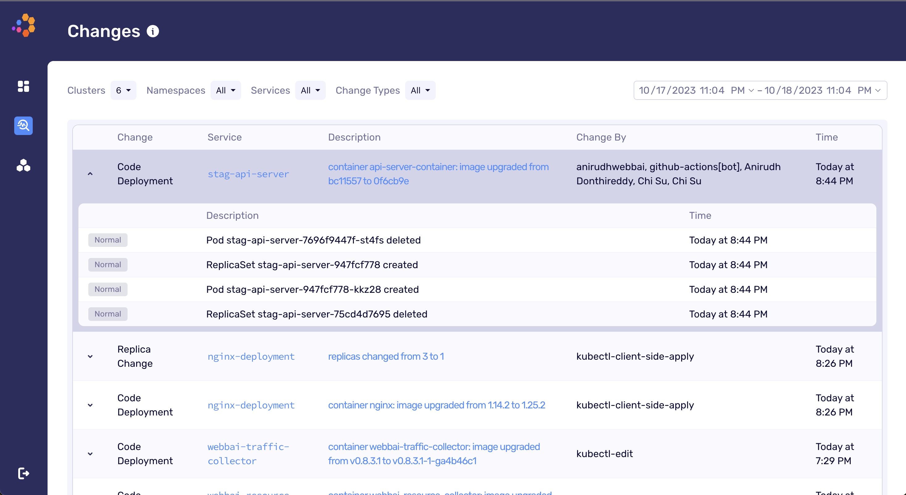
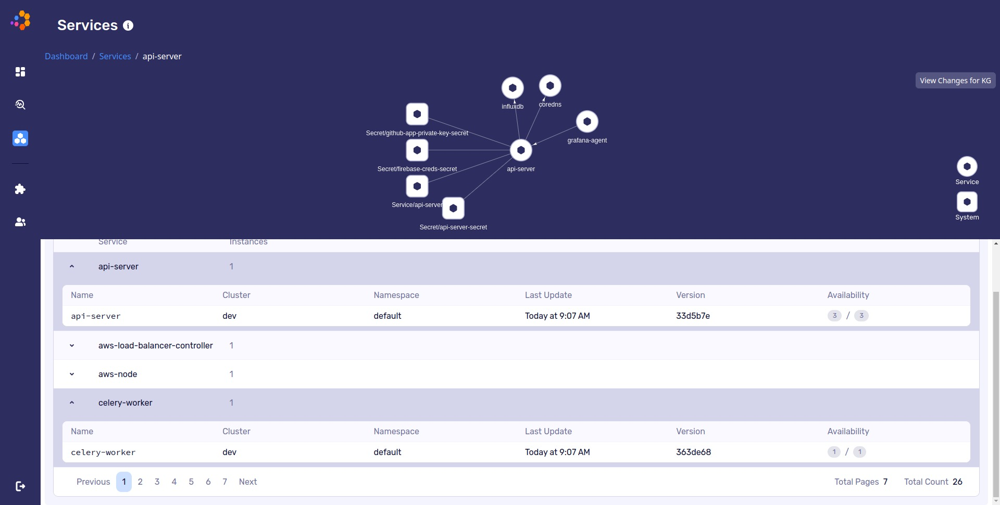

# Description

[Webb.ai](https://webb.ai) is a continuous automated root cause analysis(RCA) platform for Kubernetes. It empowers SREs, devops and engineers to debug application and infrastructure issues in Kubernetes much more efficiently. The Webb.ai RCA functionality includes the following:

1. track changes made in the Kubernetes cluster
2. understand the potential impact of changes
3. establish causality between changes and low level Kubernetes events and changes made by Kubernetes controllers(e.g., HPA, VPA, Keda)
4. establish relevance between changes and issues through webb.ai's LLM-based debugging agent

The Webb.ai RCA solution includes:

- resource collector: agent running in your Kubernetes cluster as a single pod to collect changes, K8s metadata, and events.
- traffic collector: agent running in your Kubernetes cluster as a DaemonSet that automatically collects telemetry data based on eBPF.
- [web console](https://app.webb.ai): web interface that includes the full functionality of webb.ai.

**Notes:**

- Webb.ai is currently in early access. After installing the helm chart in your Kubernetes cluster, please email do_access@webb.ai to get access to Webb's web console to get full functionality.
- DigitalOcean is using Helm v3 to deploy webb.ai to your DOKS cluster.

Please follow the official documentation to read and learn more about [webb.ai](https://docs.webb.ai).

## Software Included

| Package      | resource collector version | traffic collector version | Helm package version | License |
|--------------|----------------------------|---------------------------|--------------------- |---------|
| webbai-agent | v0.4.8                     | v0.8.3.1                  | [0.1.5](https://github.com/webb-ai/helm-charts/releases/tag/webbai-agent-0.1.5) | [Apache 2.0](https://github.com/webb-ai/k8s-agent/blob/master/LICENSE)

## Getting Started

### How to Connect to Your Cluster

Follow these [instructions](https://www.digitalocean.com/docs/kubernetes/how-to/connect-to-cluster/) to connect to your cluster with `kubectl` and `doctl`.

### Confirming that Webb.ai is Running


First, check if the Helm installation was successful by running the command below:

```console
helm ls -n webbai
```

The output should look similar to the following:

```text
NAME        	NAMESPACE	REVISION	UPDATED                             	STATUS  	CHART             	APP VERSION
webbai-agent	webbai   	1       	2023-10-13 15:52:17.259511 -0700 PDT	deployed	webbai-agent-0.1.5	v0.4.8
```

The `STATUS` column value should be `deployed`.

Next, verify if webb.ai pods are up and running:

```console
kubectl get pods -n webbai
```

The output should look similar to the following:

```text
NAME                                         READY   STATUS    RESTARTS        AGE
webbai-resource-collector-854bc5b745-r2k74   1/1     Running   0               4d20h
webbai-traffic-collector-fkn9t               1/1     Running   0               4d20h
```

All pods should be in a `READY` state with a `STATUS` of `Running`.

### Tweaking Helm Chart Values

The webb.ai stack provides some custom values to start with. See the [values](./values.yml) file from the main GitHub repository for more information.

You can inspect all the available options, as well as the default values for the webb.ai Helm chart by running the following command:

```console
helm show values webb.ai/webbai-agent
```

After customizing the Helm values file (`values.yml`), you can apply the changes via the `helm upgrade` command, as shown below:

```console
helm upgrade webbai-agent webb.ai/webbai-agent \
  --namespace webbai \
  --values values.yml
```


### Exploring the webb.ai web console

#### Add your DOKS cluster to webb.ai

Once you get access to [webb.ai's web console](https://app.webb.ai), you can click the `integrations` button on the left to register your DOKS cluster to webb's interface. You need to upgrade the helm chart by running the command that pops up:



#### Understand changes

When the helm upgrade command runs successfully, the agents running in your cluster will start to send data to Webb.ai's backend. The web console should start to show changes made in your cluster. Webb.ai understands each change's semantics, its potential impact, and who made the change. Each logical change is categorized into 11 buckets.



#### Causality between changes

In a declarative system like Kubernetes, users specify what is the desired state in the manifests and Kubernetes controllers bring the current state to the desired state. Webb.ai is highly integrated with native kube controllers and other popular open source controllers(e.g., hpa, vpa, cluster-autoscaler). The dashboard also shows the low level events as results of high level spec changes to help you understand how K8s controllers react to your change.




#### Understand infra and service dependencies

Webb.ai understands the connectivity between services(service call graph) as well as the dependencies between different k8s object, e.g., what are the config maps, secrets, service account and ingresses that your service depends on? This is vital when doing RCA because changes in the infra and services dependencies can often cause issues in the service.




## Upgrading webb.ai Stack

You can check what versions are available to upgrade, by navigating to the [webb.ai-helm](https://github.com/webb-ai/helm-charts/releases) releases page on GitHub.

Then, to upgrade the stack to a newer version, please run the following command, replacing the `<>` placeholders:

```console
helm upgrade webbai-agent webb.ai/webbai-agent \
  --version <NEW_VERSION> \
  --namespace webbai \
  --values <YOUR_HELM_VALUES_FILE>
```

See [helm upgrade](https://helm.sh/docs/helm/helm_upgrade/) for more information about the command.


## Uninstalling webb.ai Stack

To delete your installation of `webb.ai`, run the following command:

```console
helm uninstall webbai-agent -n webbai
```

**Note:**

The command will delete all the associated Kubernetes resources installed by the `webb.ai` Helm chart, except the namespace itself. To delete the `webbai namespace` as well, run the following command:

```console
kubectl delete ns webbai
```


### Additional Resources

- [Webb.ai website](https://webb.ai)
- [Documentation](https://docs.webb.ai)
- [Neo quiz](https://webb.ai/blog/the-neo-quiz/)